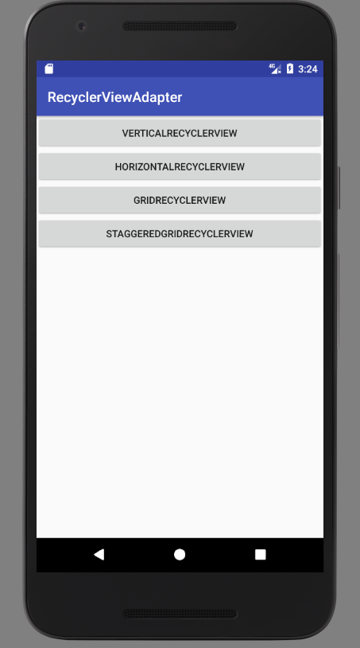
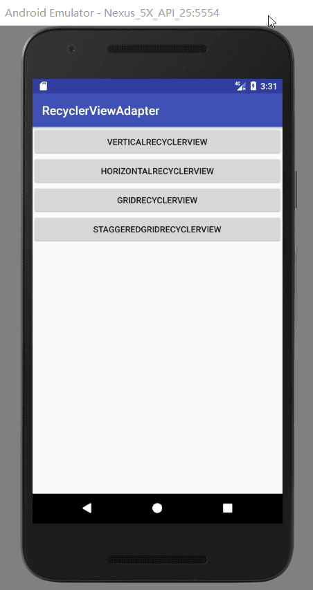
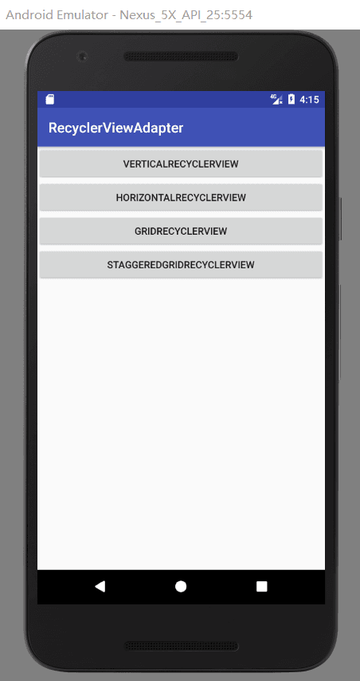
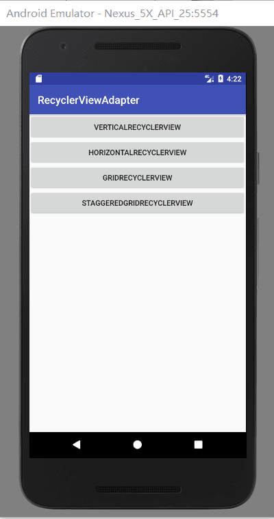
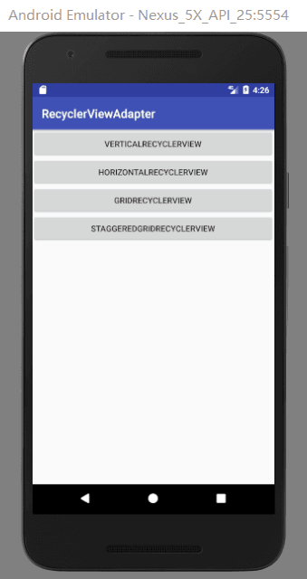
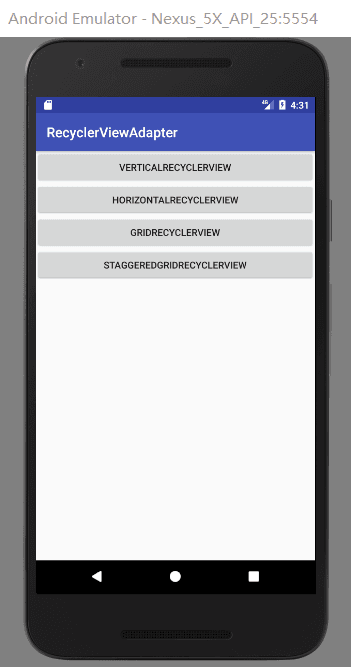
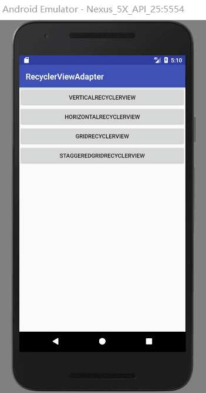

[简书](https://www.jianshu.com/p/863b27551a79)

[APK下载](https://github.com/437042721/RecyclerViewAdapter/blob/master/app/build/outputs/apk/app-debug.apk)


**使用方法**

将libray模块复制到项目中,或者直接在build.gradle中依赖:

```
allprojects {
		repositories {
			
			maven { url 'https://jitpack.io' }
		}
	}
```

```
dependencies {
	        compile 'com.github.AnJiaoDe:RecyclerViewAdapter:1.1.1'
	}
```

在没有万能RV适配器的时候是这样写代码的

```
    private class CurrHolder extends RecyclerView.ViewHolder implements
            OnClickListener, ItemSelectListener {
        ImageView album, menu;
        TextView title, artist;
        View splite, state;
        Music music;

        public CurrHolder(View view) {
            super(view);
            album = (ImageView) view.findViewById(R.id.music_item_album);
            menu = (ImageView) view.findViewById(R.id.music_item_menu);
            title = (TextView) view.findViewById(R.id.music_item_title);
            artist = (TextView) view.findViewById(R.id.music_item_artist);
            splite = view.findViewById(R.id.music_item_splite);
            state = view.findViewById(R.id.music_item_state);
            menu.setImageResource(mTheme.isColorTheme() ? R.drawable.ic_item_menu
                    : R.drawable.ic_item_menu_w);
            if (splite != null) {
                splite.setBackgroundColor(mTheme.getDividerColor());
            }
            state.setBackgroundColor(mTheme.color);
            itemView.setOnClickListener(this);
            ViewUtil.setViewBg(itemView, mTheme.getItemSelector());
        }
```
 构造方法能写到怀疑人生
 
 有万能适配的时候是这样写代码的

  

```
    List<VRBean> list = new ArrayList<>();
        for (int i=0;i<100;i++){
            list.add(new VRBean("内容"+i));
        }
        rvAdapter = new RVAdapter<VRBean>(list) {
            @Override
            public void bindDataToView(MyViewHolder holder, int position, VRBean bean, boolean isSelected) {
                holder.setText(R.id.tv, bean.getStr());
            }

            @Override
            public int getItemLayoutID(int position, VRBean bean) {
                return R.layout.item_rv;
            }


            @Override
            public void onItemClick(int position, VRBean bean) {
                showToast("点击" + position);

            }
        };
        ((VerticalRecyclerView) findViewById(R.id.vr)).setAdapter(rvAdapter);
```
  
 
 流水线式编程，各种复制粘贴



**1.VerticalRecyclerView**

**1.1VR**



```
<?xml version="1.0" encoding="utf-8"?>
<com.cy.cyrvadapter.recyclerview.VerticalRecyclerView xmlns:android="http://schemas.android.com/apk/res/android"
    xmlns:tools="http://schemas.android.com/tools"
    android:id="@+id/vr"
    android:layout_width="match_parent"
    android:layout_height="match_parent" />


```

```


public class VRActivity extends BaseActivity {

    private RVAdapter<VRBean> rvAdapter;

    @Override
    protected void onCreate(Bundle savedInstanceState) {
        super.onCreate(savedInstanceState);
        setContentView(R.layout.activity_vr2);
        List<VRBean> list = new ArrayList<>();
        for (int i=0;i<100;i++){
            list.add(new VRBean("内容"+i));
        }
        rvAdapter = new RVAdapter<VRBean>(list) {
            @Override
            public void bindDataToView(MyViewHolder holder, int position, VRBean bean, boolean isSelected) {
                holder.setText(R.id.tv, bean.getStr());
            }

            @Override
            public int getItemLayoutID(int position, VRBean bean) {
                return R.layout.item_rv;
            }


            @Override
            public void onItemClick(int position, VRBean bean) {
                showToast("点击" + position);

            }
        };
        ((VerticalRecyclerView) findViewById(R.id.vr)).setAdapter(rvAdapter);
    }

    @Override
    public void onClick(View v) {

    }
}

```

**1.2VR+MultiLayout**



```
<?xml version="1.0" encoding="utf-8"?>
<com.cy.cyrvadapter.recyclerview.VerticalRecyclerView xmlns:android="http://schemas.android.com/apk/res/android"
    xmlns:tools="http://schemas.android.com/tools"
    android:id="@+id/vr"
    android:layout_width="match_parent"
    android:layout_height="match_parent" />


```

```


public class VRMultiActivity extends BaseActivity {

    private RVAdapter<VRMultiBean> rvAdapter;

    @Override
    protected void onCreate(Bundle savedInstanceState) {
        super.onCreate(savedInstanceState);
        setContentView(R.layout.activity_vrmulti);
        final List<VRMultiBean> list = new ArrayList<>();

        list.add(new VRMultiBean("忒囧途押金我积极偶就开个会积极自己交给鸡攻击huiyhuhuio8u9ehjkgh会祸害过",
                new int[]{R.drawable.pic1, R.drawable.pic2, R.drawable.pic3}, 1));
        list.add(new VRMultiBean("hi偶尔几个技能奇偶及会计进口国家囧囧而考虑过就没看了交集高科技奇偶及会计胡歌奇偶及会计",
                new int[]{R.drawable.pic5, R.drawable.pic4, R.drawable.pic3}, 2));
        list.add(new VRMultiBean("货物挤公交我黑狗竟然换个我哦我合计好几个我囧囧积极 囧囧囧囧囧窘境及囧窘境囧囧健康人格和基金囧囧花给你们",
                new int[]{R.drawable.pic4, R.drawable.pic5, R.drawable.pic3}, 3));


        list.add(new VRMultiBean("忒囧途押金我积极偶就开个会积极自己交给鸡攻击huiyhuhuio8u9ehjkgh会祸害过",
                new int[]{R.drawable.pic4, R.drawable.pic2, R.drawable.pic1}, 1));
        list.add(new VRMultiBean("货物挤公交我黑狗乐观我乳胶管我哦惹急hi偶然和基金法科技馆一积极几颗 自己进欧冠竟然换个我哦健康人格和基金囧囧花给你们",
                new int[]{R.drawable.pic4, R.drawable.pic5, R.drawable.pic3}, 3));
        list.add(new VRMultiBean("忒囧途押金我积极偶就开个会积极自己交给鸡攻击huiyhuhuio8u9ehjkgh会祸害过",
                new int[]{R.drawable.pic1, R.drawable.pic2, R.drawable.pic3}, 1));

        list.add(new VRMultiBean("忒囧途押金我积极偶就开个会积极自己交给鸡攻击huiyhuhuio8u9ehjkgh会祸害过",
                new int[]{R.drawable.pic4, R.drawable.pic2, R.drawable.pic1}, 2));
        list.add(new VRMultiBean("货物挤公交我黑狗乐观我乳胶管我哦惹急hi偶然和基金法科技馆一积极几颗 自己进欧冠竟然换个我哦健康人格和基金囧囧花给你们",
                new int[]{R.drawable.pic4, R.drawable.pic5, R.drawable.pic3}, 3));
        list.add(new VRMultiBean("忒囧途押金我积极偶就开个会积极自己交给鸡攻击huiyhuhuio8u9ehjkgh会祸害过",
                new int[]{R.drawable.pic1, R.drawable.pic2, R.drawable.pic3}, 1));

        list.add(new VRMultiBean("忒囧途押金我积极偶就开个会积极自己交给鸡攻击huiyhuhuio8u9ehjkgh会祸害过",
                new int[]{R.drawable.pic4, R.drawable.pic2, R.drawable.pic1}, 2));
        list.add(new VRMultiBean("货物挤公交我黑狗乐观我乳胶管我哦惹急hi偶然和基金法科技馆一积极几颗 自己进欧冠竟然换个我哦健康人格和基金囧囧花给你们",
                new int[]{R.drawable.pic4, R.drawable.pic5, R.drawable.pic3}, 2));
        list.add(new VRMultiBean("忒囧途押金我积极偶就开个会积极自己交给鸡攻击huiyhuhuio8u9ehjkgh会祸害过",
                new int[]{R.drawable.pic1, R.drawable.pic2, R.drawable.pic3}, 1));

        list.add(new VRMultiBean("忒囧途押金我积极偶就开个会积极自己交给鸡攻击huiyhuhuio8u9ehjkgh会祸害过",
                new int[]{R.drawable.pic4, R.drawable.pic2, R.drawable.pic1}, 2));
        list.add(new VRMultiBean("货物挤公交我黑狗乐观我乳胶管我哦惹急hi偶然和基金法科技馆一积极几颗 自己进欧冠竟然换个我哦健康人格和基金囧囧花给你们",
                new int[]{R.drawable.pic4, R.drawable.pic5, R.drawable.pic3}, 3));
        list.add(new VRMultiBean("忒囧途押金我积极偶就开个会积极自己交给鸡攻击huiyhuhuio8u9ehjkgh会祸害过",
                new int[]{R.drawable.pic1, R.drawable.pic2, R.drawable.pic3}, 1));
        rvAdapter = new RVAdapter<VRMultiBean>(list) {
            @Override
            public void bindDataToView(MyViewHolder holder, int position, VRMultiBean bean, boolean isSelected) {
                switch (bean.getView_type()) {
                    case 1:
                        holder.setText(R.id.tv,bean.getTitle());
                        holder.setImageResource(R.id.iv,bean.getResID()[0]);
                        holder.setOnClickListener(R.id.tv, new View.OnClickListener() {
                            @Override
                            public void onClick(View v) {
                                showToast("点击文字");
                            }
                        });
                        break;

                    case 2:
                        holder.setText(R.id.tv,bean.getTitle());
                        holder.setImageResource(R.id.iv_1,bean.getResID()[0]);
                        holder.setImageResource(R.id.iv_2,bean.getResID()[1]);
                        holder.setImageResource(R.id.iv_3,bean.getResID()[2]);
                        holder.setOnClickListener(R.id.tv, new View.OnClickListener() {
                            @Override
                            public void onClick(View v) {
                                showToast("点击文字");
                            }
                        });
                        break;
                    case 3:
                        holder.setText(R.id.tv,bean.getTitle());
                        holder.setImageResource(R.id.iv,bean.getResID()[0]);
                        holder.setOnClickListener(R.id.tv, new View.OnClickListener() {
                            @Override
                            public void onClick(View v) {
                                showToast("点击文字");
                            }
                        });
                        break;
                }
            }

            @Override
            public int getItemLayoutID(int position, VRMultiBean bean) {
                switch (bean.getView_type()) {
                    case 1:
                        return R.layout.item_pic_right;
                    case 2:
                        return R.layout.item_pic_bottom;
                    case 3:
                        return R.layout.item_pic_one_bottom;
                }
                return 1;
            }


            @Override
            public void onItemClick(int position, VRMultiBean bean) {

                showToast("点击"+position);
            }
        };
        ((VerticalRecyclerView) findViewById(R.id.vr)).setAdapter(rvAdapter);
    }

    @Override
    public void onClick(View v) {

    }
}

```
**1.3VR+head+foot**



```
<?xml version="1.0" encoding="utf-8"?>
<com.cy.cyrvadapter.recyclerview.VerticalRecyclerView xmlns:android="http://schemas.android.com/apk/res/android"
    xmlns:tools="http://schemas.android.com/tools"
    android:id="@+id/vr"
    android:layout_width="match_parent"
    android:layout_height="match_parent" />


```

```


public class VRHeadFootActivity extends BaseActivity {

    private RVAdapter<VRHeadFootBean> rvAdapter;
    @Override
    protected void onCreate(Bundle savedInstanceState) {
        super.onCreate(savedInstanceState);
        setContentView(R.layout.activity_vr);

        List<VRHeadFootBean> list = new ArrayList<>();
        for (int i=0;i<100;i++){
            list.add(new VRHeadFootBean("内容"+i));
        }
        rvAdapter=new RVAdapter<VRHeadFootBean>(list,true,true) {
            @Override
            public void bindDataToHeadView(MyViewHolder holder) {
                super.bindDataToHeadView(holder);
            }

            @Override
            public void bindDataToFootView(MyViewHolder holder) {
                super.bindDataToFootView(holder);
            }

            @Override
            public void bindDataToView(MyViewHolder holder, int position, VRHeadFootBean bean, boolean isSelected) {
                holder.setText(R.id.tv, bean.getStr());

            }

            @Override
            public int getItemLayoutID(int position, VRHeadFootBean bean) {
                if (position==0){
                    return R.layout.head;

                }
                if (position==getItemCount()-1){
                    return R.layout.foot;

                }
                return R.layout.item_rv;

            }

            @Override
            public void onItemClick(int position, VRHeadFootBean bean) {

                showToast("点击"+position);
            }

            @Override
            public void onItemHeadClick() {
                super.onItemHeadClick();
                showToast("点击head");

            }

            @Override
            public void onItemFootClick() {
                super.onItemFootClick();
                showToast("点击foot");

            }
        };
        ((VerticalRecyclerView) findViewById(R.id.vr)).setAdapter(rvAdapter);

    }

    @Override
    public void onClick(View v) {

    }
}

```
**1.4VR+Refresh+LoadMore**



```
<?xml version="1.0" encoding="utf-8"?>
<com.cy.cyrvadapter.refreshrv.VerticalRefreshLayout xmlns:android="http://schemas.android.com/apk/res/android"
    xmlns:tools="http://schemas.android.com/tools"
    xmlns:app="http://schemas.android.com/apk/res-auto"
    android:id="@+id/vrl"
    android:layout_width="match_parent"
    android:layout_height="match_parent">

</com.cy.cyrvadapter.refreshrv.VerticalRefreshLayout>

```

```


public class VRRefreshLoadMoreActivity extends BaseActivity {

    private RVAdapter<VRBean> rvAdapter;
    private VerticalRefreshLayout verticalRefreshLayout;
    @Override
    protected void onCreate(Bundle savedInstanceState) {
        super.onCreate(savedInstanceState);
        setContentView(R.layout.activity_vrrefresh);

        verticalRefreshLayout= (VerticalRefreshLayout) findViewById(R.id.vrl);
        List<VRBean> list = new ArrayList<>();
        for (int i=0;i<100;i++){
            list.add(new VRBean("内容"+i));
        }
        rvAdapter = new RVAdapter<VRBean>(list) {
            @Override
            public void bindDataToView(MyViewHolder holder, int position, VRBean bean, boolean isSelected) {
                holder.setText(R.id.tv, bean.getStr());
            }

            @Override
            public int getItemLayoutID(int position, VRBean bean) {
                return R.layout.item_rv;

            }


            @Override
            public void onItemClick(int position, VRBean bean) {
                showToast("点击" + position);

            }
        };
        verticalRefreshLayout.setAdapter(rvAdapter,  getResources().getColor(R.color.colorPrimary),
                new RefreshListenerAdapter() {
            @Override
            public void onRefresh(TwinklingRefreshLayout refreshLayout) {
                super.onRefresh(refreshLayout);
            }

            @Override
            public void onLoadMore(TwinklingRefreshLayout refreshLayout) {
                super.onLoadMore(refreshLayout);
            }
        });
    }

    @Override
    public void onClick(View v) {

    }
}

```
**1.5VR+Refresh**


```
<?xml version="1.0" encoding="utf-8"?>
<com.cy.cyrvadapter.refreshrv.VerticalRefreshLayout xmlns:android="http://schemas.android.com/apk/res/android"
    xmlns:tools="http://schemas.android.com/tools"
    xmlns:app="http://schemas.android.com/apk/res-auto"
    android:id="@+id/vrl"
    android:layout_width="match_parent"
    android:layout_height="match_parent">

</com.cy.cyrvadapter.refreshrv.VerticalRefreshLayout>

```

```


public class VRRefreshActivity extends BaseActivity {
    private RVAdapter<VRBean> rvAdapter;
    private VerticalRefreshLayout verticalRefreshLayout;
    @Override
    protected void onCreate(Bundle savedInstanceState) {
        super.onCreate(savedInstanceState);
        setContentView(R.layout.activity_vrrefresh2);

        verticalRefreshLayout= (VerticalRefreshLayout) findViewById(R.id.vrl);
        List<VRBean> list = new ArrayList<>();
        for (int i=0;i<100;i++){
            list.add(new VRBean("内容"+i));
        }
        rvAdapter = new RVAdapter<VRBean>(list) {
            @Override
            public void bindDataToView(MyViewHolder holder, int position, VRBean bean, boolean isSelected) {
                holder.setText(R.id.tv, bean.getStr());
            }

            @Override
            public int getItemLayoutID(int position, VRBean bean) {
                return R.layout.item_rv;

            }

            @Override
            public void onItemClick(int position, VRBean bean) {
                showToast("点击" + position);

            }
        };
        verticalRefreshLayout.setAdapter(rvAdapter,  getResources().getColor(R.color.colorPrimary),
                new BaseRefreshLayout.OnCYRefreshListener() {
            @Override
            public void onRefresh() {

            }
        });
    }

    @Override
    public void onClick(View v) {

    }
}


```
**1.6VR+LoadMore**



```
<?xml version="1.0" encoding="utf-8"?>
<com.cy.cyrvadapter.refreshrv.VerticalRefreshLayout xmlns:android="http://schemas.android.com/apk/res/android"
    xmlns:tools="http://schemas.android.com/tools"
    xmlns:app="http://schemas.android.com/apk/res-auto"
    android:id="@+id/vrl"
    android:layout_width="match_parent"
    android:layout_height="match_parent">

</com.cy.cyrvadapter.refreshrv.VerticalRefreshLayout>

```

```

public class VRLoadMoreActivity extends BaseActivity {
    private RVAdapter<VRBean> rvAdapter;
    private VerticalRefreshLayout verticalRefreshLayout;
    @Override
    protected void onCreate(Bundle savedInstanceState) {
        super.onCreate(savedInstanceState);
        setContentView(R.layout.activity_vrload_more);


        verticalRefreshLayout= (VerticalRefreshLayout) findViewById(R.id.vrl);
        List<VRBean> list = new ArrayList<>();
        for (int i=0;i<100;i++){
            list.add(new VRBean("内容"+i));
        }
        rvAdapter = new RVAdapter<VRBean>(list) {
            @Override
            public void bindDataToView(MyViewHolder holder, int position, VRBean bean, boolean isSelected) {
                holder.setText(R.id.tv, bean.getStr());
            }

            @Override
            public int getItemLayoutID(int position, VRBean bean) {
                return R.layout.item_rv;
            }


            @Override
            public void onItemClick(int position, VRBean bean) {
                showToast("点击" + position);

            }
        };
        verticalRefreshLayout.setAdapter(rvAdapter,  getResources().getColor(R.color.colorPrimary),
                new BaseRefreshLayout.OnCYLoadMoreLister() {
            @Override
            public void onLoadMore() {

            }
        });
    }

    @Override
    public void onClick(View v) {

    }
}


```

**1.7VR+Swipe**


```
<?xml version="1.0" encoding="utf-8"?>
<com.cy.cyrvadapter.recyclerview.SwipeRecyclerView xmlns:android="http://schemas.android.com/apk/res/android"
    xmlns:tools="http://schemas.android.com/tools"
    android:id="@+id/srv"
    android:layout_width="match_parent"
    android:layout_height="match_parent">

</com.cy.cyrvadapter.recyclerview.SwipeRecyclerView>

```

```


public class VRSwipeActivity extends BaseActivity {
    private SwipeRVAdapter<VRBean> rvAdapter;

    @Override
    protected void onCreate(Bundle savedInstanceState) {
        super.onCreate(savedInstanceState);
        setContentView(R.layout.activity_vrswipe);

        final ArrayList<VRBean> list_bean = new ArrayList<VRBean>();
        for (int i = 0; i < 100; i++) {
            list_bean.add(new VRBean("内容"+i));
        }


        rvAdapter = new SwipeRVAdapter<VRBean>(list_bean) {


            @Override
            public void bindSwipeDataToView(MyViewHolder holder, int position, VRBean bean, boolean isSelected) {
                holder.setText(R.id.tv, bean.getStr());


                holder.setOnClickListener(R.id.tv_zhiding, new View.OnClickListener() {
                    @Override
                    public void onClick(View v) {
                        rvAdapter.closeOpenedSL();
                        showToast("点击置顶");

                    }
                });
                holder.setOnClickListener(R.id.tv_biaoweiweidu, new View.OnClickListener() {
                    @Override
                    public void onClick(View v) {
                        rvAdapter.closeOpenedSL();

                        showToast("点击标为未读");

                    }
                });
                holder.setOnClickListener(R.id.layout_delete, new View.OnClickListener() {
                    @Override
                    public void onClick(View v) {
                        rvAdapter.closeOpenedSL();

                        showToast("点击删除");

                    }
                });
            }

            @Override
            public int getItemLayoutID(int position, VRBean bean) {
                return R.layout.item_swipe;

            }


            @Override
            public void onItemClick(int position, VRBean bean) {
                showToast("点击内容");

            }


        };
        ((SwipeRecyclerView)findViewById(R.id.srv)).setAdapter(rvAdapter);
    }

    @Override
    public void onClick(View v) {

    }
}

```
**2.HorizontalRecyclerView**


```
<?xml version="1.0" encoding="utf-8"?>
<com.cy.cyrvadapter.recyclerview.HorizontalRecyclerView xmlns:android="http://schemas.android.com/apk/res/android"
    xmlns:tools="http://schemas.android.com/tools"
    android:id="@+id/hrv"
    android:layout_width="match_parent"
    android:layout_height="300dp">

</com.cy.cyrvadapter.recyclerview.HorizontalRecyclerView>

```

```


public class HRVActivity extends BaseActivity {

    private RVAdapter<HRVBean> rvAdapter;

    @Override
    protected void onCreate(Bundle savedInstanceState) {
        super.onCreate(savedInstanceState);
        setContentView(R.layout.activity_hrv);
        List<HRVBean> list = new ArrayList<>();
        for (int i=0;i<10;i++){
            if (i%5==0){
                list.add(new HRVBean(R.drawable.pic3));
                continue;

            }
            list.add(new HRVBean(R.drawable.pic1));
        }
        rvAdapter = new RVAdapter<HRVBean>(list) {
            @Override
            public void bindDataToView(MyViewHolder holder, int position, HRVBean bean, boolean isSelected) {

                holder.setImageResource(R.id.iv,bean.getResID());

            }

            @Override
            public int getItemLayoutID(int position, HRVBean bean) {
                return R.layout.item_hrv;
            }


            @Override
            public void onItemClick(int position, HRVBean bean) {

            }
        };
        ((HorizontalRecyclerView)findViewById(R.id.hrv)).setAdapter(rvAdapter);
    }

    @Override
    public void onClick(View v) {

    }
}

```
**3.GridRecyclerView**

**3.1GRV**


```
<?xml version="1.0" encoding="utf-8"?>
<com.cy.cyrvadapter.recyclerview.GridRecyclerView xmlns:android="http://schemas.android.com/apk/res/android"
    xmlns:tools="http://schemas.android.com/tools"
    android:id="@+id/grv"
    android:paddingRight="10dp"
    android:paddingBottom="10dp"
    android:layout_width="match_parent"
    android:layout_height="match_parent">

</com.cy.cyrvadapter.recyclerview.GridRecyclerView>

```

```


public class GRVActivity extends BaseActivity {

    private RVAdapter<HRVBean> rvAdapter;
    @Override
    protected void onCreate(Bundle savedInstanceState) {
        super.onCreate(savedInstanceState);
        setContentView(R.layout.activity_grv);
        List<HRVBean> list = new ArrayList<>();
        for (int i=0;i<100;i++){
            if (i%5==0){
                list.add(new HRVBean(R.drawable.pic3));
                continue;

            }
            list.add(new HRVBean(R.drawable.pic1));
        }
        rvAdapter=new RVAdapter<HRVBean>(list) {
            @Override
            public void bindDataToView(MyViewHolder holder, int position, HRVBean bean, boolean isSelected) {


                holder.setImageResource(R.id.iv,bean.getResID());
            }

            @Override
            public int getItemLayoutID(int position, HRVBean bean) {
                return R.layout.item_grv;
            }


            @Override
            public void onItemClick(int position, HRVBean bean) {

            }
        };
        ((GridRecyclerView)findViewById(R.id.grv)).setAdapter(rvAdapter,3,false,false);
    }

    @Override
    public void onClick(View v) {

    }
}

```
**3.2GRV+head+foot**


```
<?xml version="1.0" encoding="utf-8"?>
<com.cy.cyrvadapter.recyclerview.GridRecyclerView xmlns:android="http://schemas.android.com/apk/res/android"
    xmlns:tools="http://schemas.android.com/tools"
    android:id="@+id/grv"
    android:paddingRight="10dp"
    android:paddingBottom="10dp"
    android:layout_width="match_parent"
    android:layout_height="match_parent">

</com.cy.cyrvadapter.recyclerview.GridRecyclerView>

```

```

public class GRVHeadFootActivity extends BaseActivity {
    private RVAdapter<HRVBean> rvAdapter;

    @Override
    protected void onCreate(Bundle savedInstanceState) {
        super.onCreate(savedInstanceState);
        setContentView(R.layout.activity_grvhead_foot);

        List<HRVBean> list = new ArrayList<>();
        for (int i = 0; i < 99; i++) {
            if (i % 5 == 0) {
                list.add(new HRVBean(R.drawable.pic3));
                continue;

            }
            list.add(new HRVBean(R.drawable.pic1));
        }
        rvAdapter = new RVAdapter<HRVBean>(list, true, true) {
            @Override
            public void bindDataToHeadView(MyViewHolder holder) {
                super.bindDataToHeadView(holder);
            }
            @Override
            public void bindDataToFootView(MyViewHolder holder) {
                super.bindDataToFootView(holder);
            }

            @Override
            public void bindDataToView(MyViewHolder holder, int position, HRVBean bean, boolean isSelected) {


                holder.setImageResource(R.id.iv, bean.getResID());
            }

            @Override
            public int getItemLayoutID(int position, HRVBean bean) {
                if (position == 0) {
                    return R.layout.head;
                }
                if (position == getItemCount() - 1) {
                    return R.layout.foot;
                }
                return R.layout.item_grv;
            }


            @Override
            public void onItemClick(int position, HRVBean bean) {


            }

            @Override
            public void onItemHeadClick() {
                super.onItemHeadClick();
            }

            @Override
            public void onItemFootClick() {
                super.onItemFootClick();
            }
        };
        ((GridRecyclerView) findViewById(R.id.grv)).setAdapter(rvAdapter, 3,true,true);
    }

    @Override
    public void onClick(View v) {

    }
}

```

**3.3GRV+Refresh+LoadMore**


```


public class GRVRefreshLoadMoreActivity extends BaseActivity {
    private RVAdapter<HRVBean> rvAdapter;

    @Override
    protected void onCreate(Bundle savedInstanceState) {
        super.onCreate(savedInstanceState);
        setContentView(R.layout.activity_grvrefresh_load_more);

        List<HRVBean> list = new ArrayList<>();
        for (int i=0;i<100;i++){
            if (i%5==0){
                list.add(new HRVBean(R.drawable.pic3));
                continue;

            }
            list.add(new HRVBean(R.drawable.pic1));
        }

        rvAdapter=new RVAdapter<HRVBean>(list) {
            @Override
            public void bindDataToView(MyViewHolder holder, int position, HRVBean bean, boolean isSelected) {


                holder.setImageResource(R.id.iv,bean.getResID());
            }

            @Override
            public int getItemLayoutID(int position, HRVBean bean) {
                return R.layout.item_grv;
            }


            @Override
            public void onItemClick(int position, HRVBean bean) {

            }
        };

        ((GridRefreshLayout)findViewById(R.id.grl)).setAdapter(rvAdapter, 3, false, false,
                getResources().getColor(R.color.colorPrimary),new RefreshListenerAdapter() {
            @Override
            public void onRefresh(TwinklingRefreshLayout refreshLayout) {
                super.onRefresh(refreshLayout);
            }

            @Override
            public void onLoadMore(TwinklingRefreshLayout refreshLayout) {
                super.onLoadMore(refreshLayout);
            }
        });
    }

    @Override
    public void onClick(View v) {

    }
}

```
**4.StaggeredGridRecyclerView**

**4.1SGRV**


```
<?xml version="1.0" encoding="utf-8"?>
<com.cy.cyrvadapter.recyclerview.StaggeredGridRecyclerView xmlns:android="http://schemas.android.com/apk/res/android"
    xmlns:tools="http://schemas.android.com/tools"
    android:id="@+id/grv"
    android:paddingRight="10dp"
    android:paddingBottom="10dp"
    android:layout_width="match_parent"
    android:layout_height="match_parent">

</com.cy.cyrvadapter.recyclerview.StaggeredGridRecyclerView>

```

```

public class SGRVActivity extends BaseActivity {
    private RVAdapter<SGRVBean> rvAdapter;

    @Override
    protected void onCreate(Bundle savedInstanceState) {
        super.onCreate(savedInstanceState);
        setContentView(R.layout.activity_sgrv);


        List<SGRVBean> list = new ArrayList<>();
        for (int i = 0; i < 100; i++) {
            if (i % 5 == 0) {
                list.add(new SGRVBean("https://ss1.bdstatic.com/70cFvXSh_Q1YnxGkpoWK1HF6hhy/it/u=3367190441,1778923800&fm=27&gp=0.jpg",
                        "接地极给客人就公开房间观看然后呢开飞机后肌肉及推介会IT界hi让他开户及"));
                continue;

            }
            list.add(new SGRVBean("https://timgsa.baidu.com/timg?image&quality=80&size=b9999_10000&sec=1523372810354&di=f4e6cb5fbef06087acb322973b8cf432&imgtype=0&src=http%3A%2F%2Fimg3.duitang.com%2Fuploads%2Fitem%2F201605%2F11%2F20160511200420_WxrRN.jpeg",
                    "个哥哥"));
        }
        rvAdapter = new RVAdapter<SGRVBean>(list) {
            @Override
            public void bindDataToView(final MyViewHolder holder, int position, SGRVBean bean, boolean isSelected) {

                holder.setText(R.id.tv,bean.getText());

                holder.setImage(R.id.iv,bean.getUrl());


            }

            @Override
            public int getItemLayoutID(int position, SGRVBean bean) {
                return R.layout.item_sgrv;
            }


            @Override
            public void onItemClick(int position, SGRVBean bean) {

                showToast("点击" + position);
            }
        };
        ((StaggeredGridRecyclerView) findViewById(R.id.grv)).setAdapter(rvAdapter, 3, RecyclerView.VERTICAL);
    }

    @Override
    public void onClick(View v) {

    }
}
```
**4.2SGRV+head+foot**


```
<?xml version="1.0" encoding="utf-8"?>
<com.cy.cyrvadapter.recyclerview.StaggeredGridRecyclerView xmlns:android="http://schemas.android.com/apk/res/android"
    xmlns:tools="http://schemas.android.com/tools"
    android:id="@+id/grv"
    android:paddingRight="10dp"
    android:paddingBottom="10dp"
    android:layout_width="match_parent"
    android:layout_height="match_parent">

</com.cy.cyrvadapter.recyclerview.StaggeredGridRecyclerView>

```

```


public class SGRVHeadFootActivity extends BaseActivity {
    private RVAdapter<HRVBean> rvAdapter;

    @Override
    protected void onCreate(Bundle savedInstanceState) {
        super.onCreate(savedInstanceState);
        setContentView(R.layout.activity_sgrvhead_foot);


        List<HRVBean> list = new ArrayList<>();
        for (int i = 0; i < 99; i++) {
            if (i % 5 == 0) {
                list.add(new HRVBean(R.drawable.pic3));
                continue;

            }
            list.add(new HRVBean(R.drawable.pic7));
        }
        rvAdapter = new RVAdapter<HRVBean>(list, true,true,true) {
            @Override
            public void bindDataToHeadView(MyViewHolder holder) {
                super.bindDataToHeadView(holder);
            }
            @Override
            public void bindDataToFootView(MyViewHolder holder) {
                super.bindDataToFootView(holder);
            }

            @Override
            public void bindDataToView(MyViewHolder holder, int position, HRVBean bean, boolean isSelected) {


                holder.setImageResource(R.id.iv, bean.getResID());
            }

            @Override
            public int getItemLayoutID(int position, HRVBean bean) {
                if (position == 0) {
                    return R.layout.head;
                }
                if (position == getItemCount() - 1) {
                    return R.layout.foot;
                }
                return R.layout.item_grv;
            }


            @Override
            public void onItemClick(int position, HRVBean bean) {

                showToast("点击"+position);

            }

            @Override
            public void onItemHeadClick() {
                super.onItemHeadClick();
            }

            @Override
            public void onItemFootClick() {
                super.onItemFootClick();
            }
        };
        ((StaggeredGridRecyclerView) findViewById(R.id.grv)).setAdapter(rvAdapter, 3, RecyclerView.VERTICAL);
    }

    @Override
    public void onClick(View v) {

    }
}


```
**4.3SGRV+Refresh+LoadMore**



```
<?xml version="1.0" encoding="utf-8"?>
<com.cy.cyrvadapter.refreshrv.StaggeredGridRefreshLayout xmlns:android="http://schemas.android.com/apk/res/android"
    xmlns:tools="http://schemas.android.com/tools"
    android:id="@+id/sgrl"
    android:layout_width="match_parent"
    android:layout_height="match_parent"
    android:layout_marginBottom="10dp"
    android:layout_marginRight="10dp">

</com.cy.cyrvadapter.refreshrv.StaggeredGridRefreshLayout>

```

```


public class SGRVRefreshLoadMoreActivity extends BaseActivity {
    private RVAdapter<HRVBean> rvAdapter;

    @Override
    protected void onCreate(Bundle savedInstanceState) {
        super.onCreate(savedInstanceState);
        setContentView(R.layout.activity_sgrvrefresh_load_more);
        List<HRVBean> list = new ArrayList<>();
        for (int i=0;i<100;i++){
            if (i%5==0){
                list.add(new HRVBean(R.drawable.pic3));
                continue;

            }
            list.add(new HRVBean(R.drawable.pic7));
        }

        rvAdapter=new RVAdapter<HRVBean>(list) {
            @Override
            public void bindDataToView(MyViewHolder holder, int position, HRVBean bean, boolean isSelected) {


                holder.setImageResource(R.id.iv,bean.getResID());
            }

            @Override
            public int getItemLayoutID(int position, HRVBean bean) {
                return R.layout.item_grv;
            }


            @Override
            public void onItemClick(int position, HRVBean bean) {

            }
        };

        ((StaggeredGridRefreshLayout)findViewById(R.id.sgrl)).setAdapter(rvAdapter, 3, RecyclerView.VERTICAL,
                getResources().getColor(R.color.colorPrimary),new RefreshListenerAdapter() {
            @Override
            public void onRefresh(TwinklingRefreshLayout refreshLayout) {
                super.onRefresh(refreshLayout);
            }

            @Override
            public void onLoadMore(TwinklingRefreshLayout refreshLayout) {
                super.onLoadMore(refreshLayout);
            }
        });
    }

    @Override
    public void onClick(View v) {

    }
}


```
  RVAdapter:
 可自行在holder中扩展任意方法
 

```

public abstract class RVAdapter<T> extends RecyclerView.Adapter<RVAdapter.MyViewHolder> {
    private List<T> list_bean;
    private boolean haveHeadView = false;
    private boolean haveFootView = false;
    private boolean isStaggeredGrid = false;
    private int selectedPosition = 0; //默认选中位置
    private int lastSelectedPosition = 0; //上次选中位置


    public RVAdapter(List<T> list_bean) {
        this.list_bean = list_bean;
    }

    public RVAdapter(List<T> list, boolean isStaggeredGrid) {
        this.list_bean = list;
        this.isStaggeredGrid = isStaggeredGrid;
    }

    public RVAdapter(List<T> list_bean, boolean haveHeadView, boolean haveFootView) {

        this.haveFootView = haveFootView;
        this.haveHeadView = haveHeadView;
        this.list_bean = list_bean;
        if (haveHeadView) {
            selectedPosition = 1;
            lastSelectedPosition = 1;
        }
    }

    public RVAdapter(List<T> list_bean, boolean isStaggeredGrid, boolean haveHeadView, boolean haveFootView) {
        this.isStaggeredGrid = isStaggeredGrid;

        this.haveFootView = haveFootView;
        this.haveHeadView = haveHeadView;
        this.list_bean = list_bean;
        if (haveHeadView) {
            selectedPosition = 1;
            lastSelectedPosition = 1;
        }
    }


    @Override
    public final MyViewHolder onCreateViewHolder(ViewGroup parent, int viewType) {
        return new MyViewHolder(LayoutInflater.from(parent.getContext()).inflate(viewType, parent, false));
    }

    @Override
    public final void onBindViewHolder(final MyViewHolder holder, final int position) {

        if (isStaggeredGrid) {
            // 获取cardview的布局属性，记住这里要是布局的最外层的控件的布局属性，如果是里层的会报cast错误
            StaggeredGridLayoutManager.LayoutParams layoutParams = (StaggeredGridLayoutManager.LayoutParams) holder.itemView.getLayoutParams();
//         最最关键一步，设置当前view占满列数，这样就可以占据两列实现头部了
            if (haveHeadView) {
                if (haveFootView && position == getItemCount() - 1) {
                    layoutParams.setFullSpan(true);

                }
                if (position == 0) {

                    layoutParams.setFullSpan(true);
                }
            } else if (haveFootView) {
                if (position == getItemCount() - 1) {
                    layoutParams.setFullSpan(true);

                }
            }
        }


        //添加Item的点击事件
        holder.itemView.setOnClickListener(new View.OnClickListener() {
            @Override
            public void onClick(View v) {
                if (haveHeadView) {
                    if (position == 0) {
                        onItemHeadClick();
                        return;
                    }
                    if (haveFootView) {
                        if (position == getItemCount() - 1) {
                            onItemFootClick();
                            return;
                        }
                    }

                } else {
                    if (haveFootView) {
                        if (position == getItemCount() - 1) {
                            onItemFootClick();
                            return;
                        }
                    }
                }
                if (haveHeadView) {

                    onItemClick(position, list_bean.get(position - 1));
                } else {
                    onItemClick(position, list_bean.get(position));

                }

                if (lastSelectedPosition == position) {
                    return;
                }
                selectedPosition = position; //选择的position赋值给参数，
                notifyItemChanged(selectedPosition);
                notifyItemChanged(lastSelectedPosition);

                lastSelectedPosition = position;

            }
        });
        //有头部
        if (haveHeadView) {
            if (position == 0) {
//                if (list_bean.size() > 0) {

                bindDataToHeadView(holder);
//                }
                return;
            }
            if (haveFootView) {
                if (position == getItemCount() - 1) {
//                    if (list_bean.size() > 0) {
                    bindDataToFootView(holder);
//                    }
                    return;
                }
            }
            if (position == selectedPosition) {
                bindDataToView(holder, position - 1, list_bean.get(position - 1), true);

            } else {
                bindDataToView(holder, position - 1, list_bean.get(position - 1), false);

            }

        } else {
            if (haveFootView) {
                if (position == getItemCount() - 1) {
//                    if (list_bean.size() > 0) {

                    bindDataToFootView(holder);
//                    }
                    return;
                }
            }
            if (position == selectedPosition) {
                bindDataToView(holder, position, list_bean.get(position), true);

            } else {
                bindDataToView(holder, position, list_bean.get(position), false);


            }
        }


    }

    //填充数据
    public abstract void bindDataToView(MyViewHolder holder, int position, T bean, boolean isSelected);

    //添加头部
    public void bindDataToHeadView(MyViewHolder holder) {
    }

    //添加尾部
    public void bindDataToFootView(MyViewHolder holder) {
    }


    @Override
    public final int getItemCount() {
        if (haveHeadView) {
            if (haveFootView) {
                return list_bean.size() + 2;

            }
            return list_bean.size() + 1;
        }
        if (haveFootView) {
            return list_bean.size() + 1;
        }

        return list_bean.size();
    }

    public void removeFoot() {
        haveFootView = false;
        notifyDataSetChanged();
    }

    public boolean isHaveFootView() {
        return haveFootView;
    }

    /*
      取得ItemView的布局文件
      @return
     */
    public abstract int getItemLayoutID(int position, T bean);

    @Override
    public final int getItemViewType(int position) {

        if (haveHeadView) {
            if (haveFootView && position == getItemCount() - 1) {

                return getItemLayoutID(position, null);

            }
            return getItemLayoutID(position, position == 0 ? null : list_bean.get(position - 1));

        }
        if (haveFootView && position == getItemCount() - 1) {

            return getItemLayoutID(position, null);

        }
        return getItemLayoutID(position, list_bean.get(position));
    }

    public int getRealItemCount() {
        return list_bean.size();
    }
   /*
      ItemView的单击事件

      @param position
     */

    public abstract void onItemClick(int position, T bean);

    public void onItemHeadClick() {
    }

    public void onItemFootClick() {
    }

    public void onItemLongClick(int position) {
    }

    public void onItemHeadLongClick() {
    }

    public void onItemFootLongClick() {
    }

    public void remove(int position) {
        list_bean.remove(position);
        notifyDataSetChanged();
    }

    public void add(T bean) {
        list_bean.add(bean);
        notifyDataSetChanged();
    }

    public void addNoNotify(T bean) {
        list_bean.add(bean);
    }

    public void addToHead(T bean) {
        list_bean.add(0, bean);
        notifyDataSetChanged();
    }

    public int addAll(List<T> beans) {
        list_bean.addAll(beans);

        notifyDataSetChanged();
        return beans.size();
    }

    public void addAll(Collection<T> c) {
        list_bean.addAll(c);
        notifyDataSetChanged();


    }

    public int clearAddAll(List<T> beans) {
        list_bean.clear();
        list_bean.addAll(beans);
        notifyDataSetChanged();

        return beans.size();
    }

    public void addAllToHead(List<T> beans) {
        list_bean.addAll(0, beans);
        notifyDataSetChanged();
    }

    public void clear() {
        list_bean.clear();
        notifyDataSetChanged();
    }

    public void clearNoNotify() {
        list_bean.clear();
    }


    public static class MyViewHolder extends RecyclerView.ViewHolder {
        private SparseArray<View> array_view;

        public MyViewHolder(View itemView) {
            super(itemView);


            array_view = new SparseArray<View>();

        }


        public <T extends View> T getView(int viewId) {

            View view = array_view.get(viewId);
            if (view == null) {
                view = itemView.findViewById(viewId);
                array_view.put(viewId, view);
            }
            return (T) view;
        }


        public MyViewHolder setVisible(int res_id) {
            getView(res_id).setVisibility(View.VISIBLE);
            return this;
        }

        public MyViewHolder setInVisible(int res_id) {
            getView(res_id).setVisibility(View.INVISIBLE);
            return this;
        }

        public void setViewGone(int res_id) {
            getView(res_id).setVisibility(View.GONE);
        }

        public void setViewVisible(int res_id) {
            getView(res_id).setVisibility(View.VISIBLE);
        }


        public void setText(int tv_id, String text) {
            TextView tv = getView(tv_id);


            tv.setText(nullToString(text));
        }

        public String nullToString(Object object) {
            return object == null ? "" : object.toString();
        }

        public void setPriceText(int tv_id, String text) {
            TextView tv = getView(tv_id);

            tv.setText("¥" + text);
        }

        public void setCountText(int tv_id, String text) {
            TextView tv = getView(tv_id);

            tv.setText("x" + text);
        }

        public void setCountText(int tv_id, int text) {
            TextView tv = getView(tv_id);

            tv.setText("x" + text);
        }

        public void setPriceText(int tv_id, int text) {
            TextView tv = getView(tv_id);

            tv.setText("¥" + text);
        }

        public void setPriceText(int tv_id, float text) {
            TextView tv = getView(tv_id);

            tv.setText("¥" + text);
        }

        public void setText(int tv_id, int text) {
            TextView tv = getView(tv_id);
            tv.setText(String.valueOf(nullToString(text)));
        }

        public void setTextColor(int tv_id, int color) {
            TextView tv = getView(tv_id);
            tv.setTextColor(color);
        }

        public String getTVText(int tv_id) {
            TextView tv = getView(tv_id);
            return tv.getText().toString().trim();
        }

        public String getETText(int tv_id) {
            EditText tv = getView(tv_id);
            return tv.getText().toString().trim();
        }

        public void setBackgroundResource(int v_id, int resid) {
            View view = getView(v_id);
            view.setBackgroundResource(resid);
        }

        public void setImageBitmap(int v_id, Bitmap bitmap) {
            ImageView view = getView(v_id);
            view.setImageBitmap(bitmap);
        }

        public void setImageResource(int v_id, int resID) {
            ImageView view = getView(v_id);
            view.setImageResource(resID);
        }

        public void setImage(int iv_id, String url, int width, int height, int default_res) {
            ImageView iv = getView(iv_id);

            GlideUtils.loadImageByGlide(itemView.getContext(), url, iv, width, height);
        }

        public void setImage(int iv_id, String url) {
            ImageView iv = getView(iv_id);

            GlideUtils.loadImageByGlide(itemView.getContext(), url, iv);
        }

        public void setImage(int iv_id, String url, int width, int height) {
            ImageView iv = getView(iv_id);

            GlideUtils.loadImageByGlide(itemView.getContext(), url, iv, width, height);
        }

        public void setProgress(int progress_id, int progress) {
            ProgressBar progressBar = getView(progress_id);
            progressBar.setProgress(progress);

        }

        public void setOnClickListener(int res_id, View.OnClickListener onClickListener) {
            getView(res_id).setOnClickListener(onClickListener);
        }

        public void setOnLongClickListener(int res_id, View.OnLongClickListener onLongClickListener) {
            getView(res_id).setOnLongClickListener(onLongClickListener);
        }


    }

}

```

 **更新日志**
 
 *V1.1.1*
  - RecyclerView超级万能适配器（多布局、head、foot、下拉刷新、上拉自动更多、滑动删除）
  
  - VerticalRecyclerView、HorizontalRecyclerView、GridRecyclerView、StaggeredRecyclerView

**License**

 Copyright [cy] [name of copyright owner]

   Licensed under the Apache License, Version 2.0 (the "License");
   you may not use this file except in compliance with the License.
   You may obtain a copy of the License at

       http://www.apache.org/licenses/LICENSE-2.0

   Unless required by applicable law or agreed to in writing, software
   distributed under the License is distributed on an "AS IS" BASIS,
   WITHOUT WARRANTIES OR CONDITIONS OF ANY KIND, either express or implied.
   See the License for the specific language governing permissions and
   limitations under the License.

[GitHub](https://github.com/AnJiaoDe)

关注专题[Android开发常用开源库](https://www.jianshu.com/c/3ff4b3951dc5)

[简书](https://www.jianshu.com/u/b8159d455c69)

 微信公众号
 

QQ群


 
