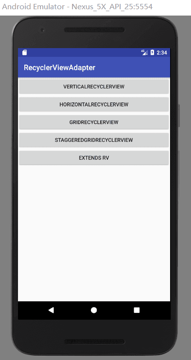
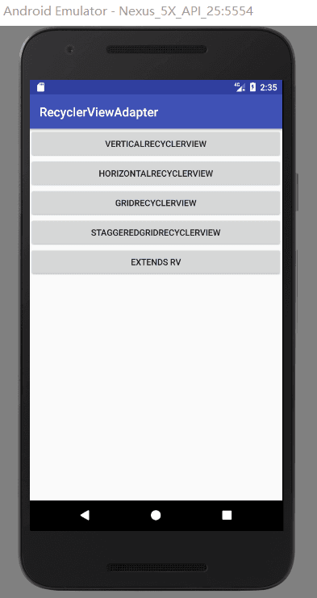

[简书](https://www.jianshu.com/p/863b27551a79)

[APK下载](https://github.com/437042721/RecyclerViewAdapter/blob/master/app/build/outputs/apk/app-debug.apk)

**欢迎star,fork,follow**

**使用方法**


将libray模块复制到项目中,或者直接在build.gradle中依赖:

```
allprojects {
		repositories {
			
			maven { url 'https://jitpack.io' }
		}
	}
```

```
dependencies {
	        compile 'com.github.AnJiaoDe:RecyclerViewAdapter:V1.1.4'
	}
	
```
**注意：如果sync报错，是因为和com.android.tools.build:gradle 3.0有关，**
**可以改将compile改为implementation 或者api** 

**目录**
集成了Glide开源库
**1.VerticalRecyclerView**
             
      1.1VR
      1.2VR+MultiLayout
      1.3VR+head+foot
      1.4VR+Refresh+LoadMore
	  1.5VR+Refresh
	  1.6VR+LoadMore
	  1.7VR+Swipe
	  1.8VR+Select
**2.HorizontalRecyclerView**
**3.GridRecyclerView**
 
      3.1GRV
      3.2GRV+head+foot
	  3.3GRV+Refresh+LoadMore
**4.StaggeredGridRecyclerView**

	  4.1SGRV
	  4.2SGRV+head+foot
	  4.3SGRV+Refresh+LoadMore
**5.extends RV(继承RVAdapter,扩展方法)**
 **6.RVAdapter源码及API使用**
 
[V1.1.3及其以下版本使用方法](https://github.com/AnJiaoDe/RecyclerViewAdapter/blob/master/README%20-%20V1.1.3%E5%8F%8A%E4%BB%A5%E4%B8%8B%E7%89%88%E6%9C%AC%E4%BD%BF%E7%94%A8%E6%96%B9%E6%B3%95.md)

在没有万能RV适配器的时候是这样写代码的

```
    private class CurrHolder extends RecyclerView.ViewHolder implements
            OnClickListener, ItemSelectListener {
        ImageView album, menu;
        TextView title, artist;
        View splite, state;
        Music music;

        public CurrHolder(View view) {
            super(view);
            album = (ImageView) view.findViewById(R.id.music_item_album);
            menu = (ImageView) view.findViewById(R.id.music_item_menu);
            title = (TextView) view.findViewById(R.id.music_item_title);
            artist = (TextView) view.findViewById(R.id.music_item_artist);
            splite = view.findViewById(R.id.music_item_splite);
            state = view.findViewById(R.id.music_item_state);
            menu.setImageResource(mTheme.isColorTheme() ? R.drawable.ic_item_menu
                    : R.drawable.ic_item_menu_w);
            if (splite != null) {
                splite.setBackgroundColor(mTheme.getDividerColor());
            }
            state.setBackgroundColor(mTheme.color);
            itemView.setOnClickListener(this);
            ViewUtil.setViewBg(itemView, mTheme.getItemSelector());
        }
```
 构造方法能写到怀疑人生
 
 有万能适配的时候是这样写代码的

  

```
    List<VRBean> list = new ArrayList<>();
        for (int i=0;i<100;i++){
            list.add(new VRBean("内容"+i));
        }
        rvAdapter = new RVAdapter<VRBean>(list) {
            @Override
            public void bindDataToView(MyViewHolder holder, int position, VRBean bean, boolean isSelected) {
                holder.setText(R.id.tv, bean.getStr());
            }

            @Override
            public int getItemLayoutID(int position, VRBean bean) {
                return R.layout.item_rv;
            }


            @Override
            public void onItemClick(int position, VRBean bean) {
                showToast("点击" + position);

            }
        };
        ((VerticalRecyclerView) findViewById(R.id.vr)).setAdapter(rvAdapter);
```
  
 
 流水线式编程，各种复制粘贴


**1.VerticalRecyclerView**
**1.1VR**


```
<?xml version="1.0" encoding="utf-8"?>
<com.cy.cyrvadapter.recyclerview.VerticalRecyclerView xmlns:android="http://schemas.android.com/apk/res/android"
    xmlns:tools="http://schemas.android.com/tools"
    android:id="@+id/vr"
    android:layout_width="match_parent"
    android:layout_height="match_parent" />


```

```
public class VRActivity extends BaseActivity {

    private RVAdapter<VRBean> rvAdapter;

    @Override
    protected void onCreate(Bundle savedInstanceState) {
        super.onCreate(savedInstanceState);
        setContentView(R.layout.activity_vr2);
        List<VRBean> list = new ArrayList<>();
        for (int i=0;i<100;i++){
            list.add(new VRBean("内容"+i));
        }
        rvAdapter = new RVAdapter<VRBean>(list) {
            @Override
            public void bindDataToView(RVViewHolder holder, int position, VRBean bean, boolean isSelected) {
                holder.setText(R.id.tv, bean.getStr());
            }

            @Override
            public int getItemLayoutID(int position, VRBean bean) {
                return R.layout.item_rv;
            }


            @Override
            public void onItemClick(int position, VRBean bean) {
                showToast("点击" + position);

            }
        };
        ((VerticalRecyclerView) findViewById(R.id.vr)).setAdapter(rvAdapter);
    }

    @Override
    public void onClick(View v) {

    }
}


```

**1.2VR+MultiLayout**


```
<?xml version="1.0" encoding="utf-8"?>
<com.cy.cyrvadapter.recyclerview.VerticalRecyclerView xmlns:android="http://schemas.android.com/apk/res/android"
    xmlns:tools="http://schemas.android.com/tools"
    android:id="@+id/vr"
    android:layout_width="match_parent"
    android:layout_height="match_parent" />


```

```
public class VRMultiActivity extends BaseActivity {

    private RVAdapter<VRMultiBean> rvAdapter;

    @Override
    protected void onCreate(Bundle savedInstanceState) {
        super.onCreate(savedInstanceState);
        setContentView(R.layout.activity_vrmulti);
        final List<VRMultiBean> list = new ArrayList<>();

        list.add(new VRMultiBean("忒囧途押金我积极偶就开个会积极自己交给鸡攻击huiyhuhuio8u9ehjkgh会祸害过",
                new int[]{R.drawable.pic1, R.drawable.pic2, R.drawable.pic3}, 1));
        list.add(new VRMultiBean("hi偶尔几个技能奇偶及会计进口国家囧囧而考虑过就没看了交集高科技奇偶及会计胡歌奇偶及会计",
                new int[]{R.drawable.pic5, R.drawable.pic4, R.drawable.pic3}, 2));
        list.add(new VRMultiBean("货物挤公交我黑狗竟然换个我哦我合计好几个我囧囧积极 囧囧囧囧囧窘境及囧窘境囧囧健康人格和基金囧囧花给你们",
                new int[]{R.drawable.pic4, R.drawable.pic5, R.drawable.pic3}, 3));


        list.add(new VRMultiBean("忒囧途押金我积极偶就开个会积极自己交给鸡攻击huiyhuhuio8u9ehjkgh会祸害过",
                new int[]{R.drawable.pic4, R.drawable.pic2, R.drawable.pic1}, 1));
        list.add(new VRMultiBean("货物挤公交我黑狗乐观我乳胶管我哦惹急hi偶然和基金法科技馆一积极几颗 自己进欧冠竟然换个我哦健康人格和基金囧囧花给你们",
                new int[]{R.drawable.pic4, R.drawable.pic5, R.drawable.pic3}, 3));
        list.add(new VRMultiBean("忒囧途押金我积极偶就开个会积极自己交给鸡攻击huiyhuhuio8u9ehjkgh会祸害过",
                new int[]{R.drawable.pic1, R.drawable.pic2, R.drawable.pic3}, 1));

        list.add(new VRMultiBean("忒囧途押金我积极偶就开个会积极自己交给鸡攻击huiyhuhuio8u9ehjkgh会祸害过",
                new int[]{R.drawable.pic4, R.drawable.pic2, R.drawable.pic1}, 2));
        list.add(new VRMultiBean("货物挤公交我黑狗乐观我乳胶管我哦惹急hi偶然和基金法科技馆一积极几颗 自己进欧冠竟然换个我哦健康人格和基金囧囧花给你们",
                new int[]{R.drawable.pic4, R.drawable.pic5, R.drawable.pic3}, 3));
        list.add(new VRMultiBean("忒囧途押金我积极偶就开个会积极自己交给鸡攻击huiyhuhuio8u9ehjkgh会祸害过",
                new int[]{R.drawable.pic1, R.drawable.pic2, R.drawable.pic3}, 1));

        list.add(new VRMultiBean("忒囧途押金我积极偶就开个会积极自己交给鸡攻击huiyhuhuio8u9ehjkgh会祸害过",
                new int[]{R.drawable.pic4, R.drawable.pic2, R.drawable.pic1}, 2));
        list.add(new VRMultiBean("货物挤公交我黑狗乐观我乳胶管我哦惹急hi偶然和基金法科技馆一积极几颗 自己进欧冠竟然换个我哦健康人格和基金囧囧花给你们",
                new int[]{R.drawable.pic4, R.drawable.pic5, R.drawable.pic3}, 2));
        list.add(new VRMultiBean("忒囧途押金我积极偶就开个会积极自己交给鸡攻击huiyhuhuio8u9ehjkgh会祸害过",
                new int[]{R.drawable.pic1, R.drawable.pic2, R.drawable.pic3}, 1));

        list.add(new VRMultiBean("忒囧途押金我积极偶就开个会积极自己交给鸡攻击huiyhuhuio8u9ehjkgh会祸害过",
                new int[]{R.drawable.pic4, R.drawable.pic2, R.drawable.pic1}, 2));
        list.add(new VRMultiBean("货物挤公交我黑狗乐观我乳胶管我哦惹急hi偶然和基金法科技馆一积极几颗 自己进欧冠竟然换个我哦健康人格和基金囧囧花给你们",
                new int[]{R.drawable.pic4, R.drawable.pic5, R.drawable.pic3}, 3));
        list.add(new VRMultiBean("忒囧途押金我积极偶就开个会积极自己交给鸡攻击huiyhuhuio8u9ehjkgh会祸害过",
                new int[]{R.drawable.pic1, R.drawable.pic2, R.drawable.pic3}, 1));
        rvAdapter = new RVAdapter<VRMultiBean>(list) {
            @Override
            public void bindDataToView(RVViewHolder holder, int position, VRMultiBean bean, boolean isSelected) {
                switch (bean.getView_type()) {
                    case 1:
                        holder.setText(R.id.tv,bean.getTitle());
                        holder.setImageResource(R.id.iv,bean.getResID()[0]);
                        holder.setOnClickListener(R.id.tv, new View.OnClickListener() {
                            @Override
                            public void onClick(View v) {
                                showToast("点击文字");
                            }
                        });
                        break;

                    case 2:
                        holder.setText(R.id.tv,bean.getTitle());
                        holder.setImageResource(R.id.iv_1,bean.getResID()[0]);
                        holder.setImageResource(R.id.iv_2,bean.getResID()[1]);
                        holder.setImageResource(R.id.iv_3,bean.getResID()[2]);
                        holder.setOnClickListener(R.id.tv, new View.OnClickListener() {
                            @Override
                            public void onClick(View v) {
                                showToast("点击文字");
                            }
                        });
                        break;
                    case 3:
                        holder.setText(R.id.tv,bean.getTitle());
                        holder.setImageResource(R.id.iv,bean.getResID()[0]);
                        holder.setOnClickListener(R.id.tv, new View.OnClickListener() {
                            @Override
                            public void onClick(View v) {
                                showToast("点击文字");
                            }
                        });
                        break;
                }
            }

            @Override
            public int getItemLayoutID(int position, VRMultiBean bean) {
                switch (bean.getView_type()) {
                    case 1:
                        return R.layout.item_pic_right;
                    case 2:
                        return R.layout.item_pic_bottom;
                    case 3:
                        return R.layout.item_pic_one_bottom;
                }
                return 1;
            }


            @Override
            public void onItemClick(int position, VRMultiBean bean) {

                showToast("点击"+position);
            }
        };
        ((VerticalRecyclerView) findViewById(R.id.vr)).setAdapter(rvAdapter);
    }

    @Override
    public void onClick(View v) {

    }
}


```
**1.3VR+head+foot**


```
<?xml version="1.0" encoding="utf-8"?>
<com.cy.cyrvadapter.recyclerview.VerticalRecyclerView xmlns:android="http://schemas.android.com/apk/res/android"
    xmlns:tools="http://schemas.android.com/tools"
    android:id="@+id/vr"
    android:layout_width="match_parent"
    android:layout_height="match_parent" />


```

```
public class VRHeadFootActivity extends BaseActivity {

    private RVAdapter<VRHeadFootBean> rvAdapter;
    @Override
    protected void onCreate(Bundle savedInstanceState) {
        super.onCreate(savedInstanceState);
        setContentView(R.layout.activity_vr);

        List<VRHeadFootBean> list = new ArrayList<>();
        for (int i=0;i<100;i++){
            list.add(new VRHeadFootBean("内容"+i));
        }
        rvAdapter=new RVAdapter<VRHeadFootBean>(list,true,true) {
            @Override
            public void bindDataToHeadView(RVViewHolder holder) {
                super.bindDataToHeadView(holder);
                holder.setText(R.id.tv,"head傻逼");
            }

            @Override
            public void bindDataToFootView(RVViewHolder holder) {
                super.bindDataToFootView(holder);
                holder.setText(R.id.tv,"foot傻逼");

            }

            @Override
            public void bindDataToView(RVViewHolder holder, int position, VRHeadFootBean bean, boolean isSelected) {
                holder.setText(R.id.tv, bean.getStr());

            }

            @Override
            public int getItemLayoutID(int position, VRHeadFootBean bean) {
                if (position==0){
                    return R.layout.head;

                }
                if (position==getItemCount()-1){
                    return R.layout.foot;

                }
                return R.layout.item_rv;

            }

            @Override
            public void onItemClick(int position, VRHeadFootBean bean) {

                showToast("点击"+position);
            }

            @Override
            public void onHeadClick() {
                showToast("点击head");

            }

            @Override
            public void onFootClick() {
                super.onFootClick();
                showToast("点击foot");

            }
        };
        ((VerticalRecyclerView) findViewById(R.id.vr)).setAdapter(rvAdapter);

    }

    @Override
    public void onClick(View v) {

    }
}


```
**1.4VR+Refresh+LoadMore**


```
<?xml version="1.0" encoding="utf-8"?>
<com.cy.cyrvadapter.refreshrv.VerticalRefreshLayout xmlns:android="http://schemas.android.com/apk/res/android"
    xmlns:tools="http://schemas.android.com/tools"
    xmlns:app="http://schemas.android.com/apk/res-auto"
    android:id="@+id/vrl"
    android:layout_width="match_parent"
    android:layout_height="match_parent">

</com.cy.cyrvadapter.refreshrv.VerticalRefreshLayout>

```

```
public class VRRefreshLoadMoreActivity extends BaseActivity {

    private RVAdapter<VRBean> rvAdapter;
    private VerticalRefreshLayout verticalRefreshLayout;
    @Override
    protected void onCreate(Bundle savedInstanceState) {
        super.onCreate(savedInstanceState);
        setContentView(R.layout.activity_vrrefresh);

        verticalRefreshLayout= (VerticalRefreshLayout) findViewById(R.id.vrl);
        List<VRBean> list = new ArrayList<>();
        for (int i=0;i<100;i++){
            list.add(new VRBean("内容"+i));
        }
        rvAdapter = new RVAdapter<VRBean>(list) {
            @Override
            public void bindDataToView(RVViewHolder holder, int position, VRBean bean, boolean isSelected) {
                holder.setText(R.id.tv, bean.getStr());
            }

            @Override
            public int getItemLayoutID(int position, VRBean bean) {
                return R.layout.item_rv;

            }


            @Override
            public void onItemClick(int position, VRBean bean) {
                showToast("点击" + position);

            }
        };
        verticalRefreshLayout.setAdapter(rvAdapter,  getResources().getColor(R.color.colorPrimary),
                new RefreshListenerAdapter() {
            @Override
            public void onRefresh(TwinklingRefreshLayout refreshLayout) {
                super.onRefresh(refreshLayout);
            }

            @Override
            public void onLoadMore(TwinklingRefreshLayout refreshLayout) {
                super.onLoadMore(refreshLayout);
            }
        });
    }

    @Override
    public void onClick(View v) {

    }
}

```
**1.5VR+Refresh**


```
<?xml version="1.0" encoding="utf-8"?>
<com.cy.cyrvadapter.refreshrv.VerticalRefreshLayout xmlns:android="http://schemas.android.com/apk/res/android"
    xmlns:tools="http://schemas.android.com/tools"
    xmlns:app="http://schemas.android.com/apk/res-auto"
    android:id="@+id/vrl"
    android:layout_width="match_parent"
    android:layout_height="match_parent">

</com.cy.cyrvadapter.refreshrv.VerticalRefreshLayout>

```

```
public class VRRefreshActivity extends BaseActivity {
    private RVAdapter<VRBean> rvAdapter;
    private VerticalRefreshLayout verticalRefreshLayout;
    @Override
    protected void onCreate(Bundle savedInstanceState) {
        super.onCreate(savedInstanceState);
        setContentView(R.layout.activity_vrrefresh2);

        verticalRefreshLayout= (VerticalRefreshLayout) findViewById(R.id.vrl);
        List<VRBean> list = new ArrayList<>();
        for (int i=0;i<100;i++){
            list.add(new VRBean("内容"+i));
        }
        rvAdapter = new RVAdapter<VRBean>(list) {
            @Override
            public void bindDataToView(RVViewHolder holder, int position, VRBean bean, boolean isSelected) {
                holder.setText(R.id.tv, bean.getStr());
            }

            @Override
            public int getItemLayoutID(int position, VRBean bean) {
                return R.layout.item_rv;

            }

            @Override
            public void onItemClick(int position, VRBean bean) {
                showToast("点击" + position);

            }
        };
        verticalRefreshLayout.setAdapter(rvAdapter,  getResources().getColor(R.color.colorPrimary),
                new BaseRefreshLayout.OnCYRefreshListener() {
            @Override
            public void onRefresh() {

            }
        });
    }

    @Override
    public void onClick(View v) {

    }
}


```
**1.6VR+LoadMore**


```
<?xml version="1.0" encoding="utf-8"?>
<com.cy.cyrvadapter.refreshrv.VerticalRefreshLayout xmlns:android="http://schemas.android.com/apk/res/android"
    xmlns:tools="http://schemas.android.com/tools"
    xmlns:app="http://schemas.android.com/apk/res-auto"
    android:id="@+id/vrl"
    android:layout_width="match_parent"
    android:layout_height="match_parent">

</com.cy.cyrvadapter.refreshrv.VerticalRefreshLayout>

```

```
public class VRLoadMoreActivity extends BaseActivity {
    private RVAdapter<VRBean> rvAdapter;
    private VerticalRefreshLayout verticalRefreshLayout;
    @Override
    protected void onCreate(Bundle savedInstanceState) {
        super.onCreate(savedInstanceState);
        setContentView(R.layout.activity_vrload_more);


        verticalRefreshLayout= (VerticalRefreshLayout) findViewById(R.id.vrl);
        List<VRBean> list = new ArrayList<>();
        for (int i=0;i<100;i++){
            list.add(new VRBean("内容"+i));
        }
        rvAdapter = new RVAdapter<VRBean>(list) {
            @Override
            public void bindDataToView(RVViewHolder holder, int position, VRBean bean, boolean isSelected) {
                holder.setText(R.id.tv, bean.getStr());
            }

            @Override
            public int getItemLayoutID(int position, VRBean bean) {
                return R.layout.item_rv;
            }


            @Override
            public void onItemClick(int position, VRBean bean) {
                showToast("点击" + position);

            }
        };
        verticalRefreshLayout.setAdapter(rvAdapter,  getResources().getColor(R.color.colorPrimary),
                new BaseRefreshLayout.OnCYLoadMoreLister() {
            @Override
            public void onLoadMore() {

            }
        });
    }

    @Override
    public void onClick(View v) {

    }
}

```

**1.7VR+Swipe**


```
<?xml version="1.0" encoding="utf-8"?>
<com.cy.cyrvadapter.recyclerview.SwipeRecyclerView xmlns:android="http://schemas.android.com/apk/res/android"
    xmlns:tools="http://schemas.android.com/tools"
    android:id="@+id/srv"
    android:layout_width="match_parent"
    android:layout_height="match_parent">

</com.cy.cyrvadapter.recyclerview.SwipeRecyclerView>

```

```
public class VRSwipeActivity extends BaseActivity {
    private SwipeRVAdapter<VRBean> rvAdapter;

    @Override
    protected void onCreate(Bundle savedInstanceState) {
        super.onCreate(savedInstanceState);
        setContentView(R.layout.activity_vrswipe);

        final ArrayList<VRBean> list_bean = new ArrayList<VRBean>();
        for (int i = 0; i < 100; i++) {
            list_bean.add(new VRBean("内容"+i));
        }


        rvAdapter = new SwipeRVAdapter<VRBean>(list_bean) {


            @Override
            public void bindSwipeDataToView(RVViewHolder holder, int position, VRBean bean, boolean isSelected) {
                holder.setText(R.id.tv, bean.getStr());


                holder.setOnClickListener(R.id.tv_zhiding, new View.OnClickListener() {
                    @Override
                    public void onClick(View v) {
                        rvAdapter.closeOpenedSL();
                        showToast("点击置顶");

                    }
                });
                holder.setOnClickListener(R.id.tv_biaoweiweidu, new View.OnClickListener() {
                    @Override
                    public void onClick(View v) {
                        rvAdapter.closeOpenedSL();

                        showToast("点击标为未读");

                    }
                });
                holder.setOnClickListener(R.id.layout_delete, new View.OnClickListener() {
                    @Override
                    public void onClick(View v) {
                        rvAdapter.closeOpenedSL();

                        showToast("点击删除");

                    }
                });
            }

            @Override
            public int getItemLayoutID(int position, VRBean bean) {
                return R.layout.item_swipe;

            }


            @Override
            public void onItemClick(int position, VRBean bean) {
                showToast("点击内容");

            }


        };
        ((SwipeRecyclerView)findViewById(R.id.srv)).setAdapter(rvAdapter);
    }

    @Override
    public void onClick(View v) {

    }
}

```
**1.8VR+Select**




```
<?xml version="1.0" encoding="utf-8"?>
<com.cy.cyrvadapter.recyclerview.VerticalRecyclerView xmlns:android="http://schemas.android.com/apk/res/android"
    xmlns:tools="http://schemas.android.com/tools"
    android:id="@+id/vr"
    android:layout_width="100dp"
    android:layout_height="match_parent" />


```

```
public class VRSelectActivity extends BaseActivity {
    private RVAdapter<VRBean> rvAdapter;

    @Override
    protected void onCreate(Bundle savedInstanceState) {
        super.onCreate(savedInstanceState);
        setContentView(R.layout.activity_vrselect);
        List<VRBean> list = new ArrayList<>();
        for (int i=0;i<100;i++){
            list.add(new VRBean("内容"+i));
        }
        rvAdapter = new RVAdapter<VRBean>(list) {
            @Override
            public void bindDataToView(RVViewHolder holder, int position, VRBean bean, boolean isSelected) {
                holder.setText(R.id.tv, bean.getStr());

                if (isSelected){
                    holder.setBackgroundResource(R.id.tv,R.drawable.bg_shape);
                }else {
                    holder.getView(R.id.tv).setBackgroundColor(0x00000000);
                }
            }

            @Override
            public int getItemLayoutID(int position, VRBean bean) {
                return R.layout.item_rv;
            }


            @Override
            public void onItemClick(int position, VRBean bean) {
                showToast("点击" + position);

            }
        };
        ((VerticalRecyclerView) findViewById(R.id.vr)).setAdapter(rvAdapter);
    }

    @Override
    public void onClick(View v) {

    }
}

```

**2.HorizontalRecyclerView**


```
<?xml version="1.0" encoding="utf-8"?>
<com.cy.cyrvadapter.recyclerview.HorizontalRecyclerView xmlns:android="http://schemas.android.com/apk/res/android"
    xmlns:tools="http://schemas.android.com/tools"
    android:id="@+id/hrv"
    android:layout_width="match_parent"
    android:layout_height="300dp">

</com.cy.cyrvadapter.recyclerview.HorizontalRecyclerView>

```

```
public class HRVActivity extends BaseActivity {

    private RVAdapter<HRVBean> rvAdapter;

    @Override
    protected void onCreate(Bundle savedInstanceState) {
        super.onCreate(savedInstanceState);
        setContentView(R.layout.activity_hrv);
        List<HRVBean> list = new ArrayList<>();
        for (int i=0;i<10;i++){
            if (i%5==0){
                list.add(new HRVBean(R.drawable.pic3));
                continue;

            }
            list.add(new HRVBean(R.drawable.pic1));
        }
        rvAdapter = new RVAdapter<HRVBean>(list) {
            @Override
            public void bindDataToView(RVViewHolder holder, int position, HRVBean bean, boolean isSelected) {

                holder.setImageResource(R.id.iv,bean.getResID());

            }

            @Override
            public int getItemLayoutID(int position, HRVBean bean) {
                return R.layout.item_hrv;
            }


            @Override
            public void onItemClick(int position, HRVBean bean) {

            }
        };
        ((HorizontalRecyclerView)findViewById(R.id.hrv)).setAdapter(rvAdapter);
    }

    @Override
    public void onClick(View v) {

    }
}

```
**3.GridRecyclerView**
**3.1GRV**


```
<?xml version="1.0" encoding="utf-8"?>
<com.cy.cyrvadapter.recyclerview.GridRecyclerView xmlns:android="http://schemas.android.com/apk/res/android"
    xmlns:tools="http://schemas.android.com/tools"
    android:id="@+id/grv"
    android:paddingRight="10dp"
    android:paddingBottom="10dp"
    android:layout_width="match_parent"
    android:layout_height="match_parent">

</com.cy.cyrvadapter.recyclerview.GridRecyclerView>

```

```
public class GRVActivity extends BaseActivity {

    private RVAdapter<HRVBean> rvAdapter;
    @Override
    protected void onCreate(Bundle savedInstanceState) {
        super.onCreate(savedInstanceState);
        setContentView(R.layout.activity_grv);
        List<HRVBean> list = new ArrayList<>();
        for (int i=0;i<100;i++){
            if (i%5==0){
                list.add(new HRVBean(R.drawable.pic3));
                continue;

            }
            list.add(new HRVBean(R.drawable.pic1));
        }
        rvAdapter=new RVAdapter<HRVBean>(list) {
            @Override
            public void bindDataToView(RVViewHolder holder, int position, HRVBean bean, boolean isSelected) {


                holder.setImageResource(R.id.iv,bean.getResID());
            }

            @Override
            public int getItemLayoutID(int position, HRVBean bean) {
                return R.layout.item_grv;
            }


            @Override
            public void onItemClick(int position, HRVBean bean) {

            }
        };
        ((GridRecyclerView)findViewById(R.id.grv)).setAdapter(rvAdapter,3,false,false);
    }

    @Override
    public void onClick(View v) {

    }
}

```
**3.2GRV+head+foot**


```
<?xml version="1.0" encoding="utf-8"?>
<com.cy.cyrvadapter.recyclerview.GridRecyclerView xmlns:android="http://schemas.android.com/apk/res/android"
    xmlns:tools="http://schemas.android.com/tools"
    android:id="@+id/grv"
    android:paddingRight="10dp"
    android:paddingBottom="10dp"
    android:layout_width="match_parent"
    android:layout_height="match_parent">

</com.cy.cyrvadapter.recyclerview.GridRecyclerView>

```

```
public class GRVHeadFootActivity extends BaseActivity {
    private RVAdapter<HRVBean> rvAdapter;

    @Override
    protected void onCreate(Bundle savedInstanceState) {
        super.onCreate(savedInstanceState);
        setContentView(R.layout.activity_grvhead_foot);

        List<HRVBean> list = new ArrayList<>();
        for (int i = 0; i < 99; i++) {
            if (i % 5 == 0) {
                list.add(new HRVBean(R.drawable.pic3));
                continue;

            }
            list.add(new HRVBean(R.drawable.pic1));
        }
        rvAdapter = new RVAdapter<HRVBean>(list, true, true) {
            @Override
            public void bindDataToHeadView(RVViewHolder holder) {
                super.bindDataToHeadView(holder);
            }
            @Override
            public void bindDataToFootView(RVViewHolder holder) {
                super.bindDataToFootView(holder);
            }

            @Override
            public void bindDataToView(RVViewHolder holder, int position, HRVBean bean, boolean isSelected) {


                holder.setImageResource(R.id.iv, bean.getResID());
            }

            @Override
            public int getItemLayoutID(int position, HRVBean bean) {
                if (position == 0) {
                    return R.layout.head;
                }
                if (position == getItemCount() - 1) {
                    return R.layout.foot;
                }
                return R.layout.item_grv;
            }


            @Override
            public void onItemClick(int position, HRVBean bean) {


            }

            @Override
            public void onHeadClick() {
            }

            @Override
            public void onFootClick() {
                super.onFootClick();
            }
        };
        ((GridRecyclerView) findViewById(R.id.grv)).setAdapter(rvAdapter, 3,true,true);
    }

    @Override
    public void onClick(View v) {

    }
}

```

**3.3GRV+Refresh+LoadMore**


```
<?xml version="1.0" encoding="utf-8"?>
<com.cy.cyrvadapter.refreshrv.GridRefreshLayout xmlns:android="http://schemas.android.com/apk/res/android"
    xmlns:tools="http://schemas.android.com/tools"
    android:id="@+id/grl"
    android:layout_width="match_parent"
    android:layout_height="match_parent"
    android:layout_marginBottom="10dp"
    android:layout_marginRight="10dp">

</com.cy.cyrvadapter.refreshrv.GridRefreshLayout>

```

```
public class GRVRefreshLoadMoreActivity extends BaseActivity {
    private RVAdapter<HRVBean> rvAdapter;

    @Override
    protected void onCreate(Bundle savedInstanceState) {
        super.onCreate(savedInstanceState);
        setContentView(R.layout.activity_grvrefresh_load_more);

        List<HRVBean> list = new ArrayList<>();
        for (int i=0;i<100;i++){
            if (i%5==0){
                list.add(new HRVBean(R.drawable.pic3));
                continue;

            }
            list.add(new HRVBean(R.drawable.pic1));
        }

        rvAdapter=new RVAdapter<HRVBean>(list) {
            @Override
            public void bindDataToView(RVViewHolder holder, int position, HRVBean bean, boolean isSelected) {


                holder.setImageResource(R.id.iv,bean.getResID());
            }

            @Override
            public int getItemLayoutID(int position, HRVBean bean) {
                return R.layout.item_grv;
            }


            @Override
            public void onItemClick(int position, HRVBean bean) {

            }
        };

        ((GridRefreshLayout)findViewById(R.id.grl)).setAdapter(rvAdapter, 3, false, false,
                getResources().getColor(R.color.colorPrimary),new RefreshListenerAdapter() {
            @Override
            public void onRefresh(TwinklingRefreshLayout refreshLayout) {
                super.onRefresh(refreshLayout);
            }

            @Override
            public void onLoadMore(TwinklingRefreshLayout refreshLayout) {
                super.onLoadMore(refreshLayout);
            }
        });
    }

    @Override
    public void onClick(View v) {

    }
}

```
**4.StaggeredGridRecyclerView**
**4.1SGRV**


```
<?xml version="1.0" encoding="utf-8"?>
<com.cy.cyrvadapter.recyclerview.StaggeredGridRecyclerView xmlns:android="http://schemas.android.com/apk/res/android"
    xmlns:tools="http://schemas.android.com/tools"
    android:id="@+id/grv"
    android:paddingRight="10dp"
    android:paddingBottom="10dp"
    android:layout_width="match_parent"
    android:layout_height="match_parent">

</com.cy.cyrvadapter.recyclerview.StaggeredGridRecyclerView>

```

```
public class SGRVActivity extends BaseActivity {
    private RVAdapter<SGRVBean> rvAdapter;

    @Override
    protected void onCreate(Bundle savedInstanceState) {
        super.onCreate(savedInstanceState);
        setContentView(R.layout.activity_sgrv);


        List<SGRVBean> list = new ArrayList<>();
        for (int i = 0; i < 100; i++) {
            if (i % 5 == 0) {
                list.add(new SGRVBean("https://ss1.bdstatic.com/70cFvXSh_Q1YnxGkpoWK1HF6hhy/it/u=3367190441,1778923800&fm=27&gp=0.jpg",
                        "接地极给客人就公开房间观看然后呢开飞机后肌肉及推介会IT界hi让他开户及"));
                continue;

            }
            list.add(new SGRVBean("https://timgsa.baidu.com/timg?image&quality=80&size=b9999_10000&sec=1523372810354&di=f4e6cb5fbef06087acb322973b8cf432&imgtype=0&src=http%3A%2F%2Fimg3.duitang.com%2Fuploads%2Fitem%2F201605%2F11%2F20160511200420_WxrRN.jpeg",
                    "个哥哥"));
        }
        rvAdapter = new RVAdapter<SGRVBean>(list) {
            @Override
            public void bindDataToView(final RVViewHolder holder, int position, SGRVBean bean, boolean isSelected) {

                holder.setText(R.id.tv,bean.getText());

                holder.setImage(R.id.iv,bean.getUrl());


            }

            @Override
            public int getItemLayoutID(int position, SGRVBean bean) {
                return R.layout.item_sgrv;
            }


            @Override
            public void onItemClick(int position, SGRVBean bean) {

                showToast("点击" + position);
            }
        };
        ((StaggeredGridRecyclerView) findViewById(R.id.grv)).setAdapter(rvAdapter, 3, RecyclerView.VERTICAL);
    }

    @Override
    public void onClick(View v) {

    }
}
```
**4.2SGRV+head+foot**


```
<?xml version="1.0" encoding="utf-8"?>
<com.cy.cyrvadapter.recyclerview.StaggeredGridRecyclerView xmlns:android="http://schemas.android.com/apk/res/android"
    xmlns:tools="http://schemas.android.com/tools"
    android:id="@+id/grv"
    android:paddingRight="10dp"
    android:paddingBottom="10dp"
    android:layout_width="match_parent"
    android:layout_height="match_parent">

</com.cy.cyrvadapter.recyclerview.StaggeredGridRecyclerView>

```

```
public class SGRVHeadFootActivity extends BaseActivity {
    private RVAdapter<HRVBean> rvAdapter;

    @Override
    protected void onCreate(Bundle savedInstanceState) {
        super.onCreate(savedInstanceState);
        setContentView(R.layout.activity_sgrvhead_foot);


        List<HRVBean> list = new ArrayList<>();
        for (int i = 0; i < 99; i++) {
            if (i % 5 == 0) {
                list.add(new HRVBean(R.drawable.pic3));
                continue;

            }
            list.add(new HRVBean(R.drawable.pic7));
        }
        rvAdapter = new RVAdapter<HRVBean>(list, true,true,true) {
            @Override
            public void bindDataToHeadView(RVViewHolder holder) {
                super.bindDataToHeadView(holder);
            }
            @Override
            public void bindDataToFootView(RVViewHolder holder) {
                super.bindDataToFootView(holder);
            }

            @Override
            public void bindDataToView(RVViewHolder holder, int position, HRVBean bean, boolean isSelected) {


                holder.setImageResource(R.id.iv, bean.getResID());
            }

            @Override
            public int getItemLayoutID(int position, HRVBean bean) {
                if (position == 0) {
                    return R.layout.head;
                }
                if (position == getItemCount() - 1) {
                    return R.layout.foot;
                }
                return R.layout.item_grv;
            }


            @Override
            public void onItemClick(int position, HRVBean bean) {

                showToast("点击"+position);

            }

            @Override
            public void onHeadClick() {
            }

            @Override
            public void onFootClick() {
                super.onFootClick();
            }
        };
        ((StaggeredGridRecyclerView) findViewById(R.id.grv)).setAdapter(rvAdapter, 3, RecyclerView.VERTICAL);
    }

    @Override
    public void onClick(View v) {

    }
}


```
**4.3SGRV+Refresh+LoadMore**


```
<?xml version="1.0" encoding="utf-8"?>
<com.cy.cyrvadapter.refreshrv.StaggeredGridRefreshLayout xmlns:android="http://schemas.android.com/apk/res/android"
    xmlns:tools="http://schemas.android.com/tools"
    android:id="@+id/sgrl"
    android:layout_width="match_parent"
    android:layout_height="match_parent"
    android:layout_marginBottom="10dp"
    android:layout_marginRight="10dp">

</com.cy.cyrvadapter.refreshrv.StaggeredGridRefreshLayout>

```

```
public class SGRVRefreshLoadMoreActivity extends BaseActivity {
    private RVAdapter<HRVBean> rvAdapter;

    @Override
    protected void onCreate(Bundle savedInstanceState) {
        super.onCreate(savedInstanceState);
        setContentView(R.layout.activity_sgrvrefresh_load_more);
        List<HRVBean> list = new ArrayList<>();
        for (int i=0;i<100;i++){
            if (i%5==0){
                list.add(new HRVBean(R.drawable.pic3));
                continue;

            }
            list.add(new HRVBean(R.drawable.pic7));
        }

        rvAdapter=new RVAdapter<HRVBean>(list) {
            @Override
            public void bindDataToView(RVViewHolder holder, int position, HRVBean bean, boolean isSelected) {


                holder.setImageResource(R.id.iv,bean.getResID());
            }

            @Override
            public int getItemLayoutID(int position, HRVBean bean) {
                return R.layout.item_grv;
            }


            @Override
            public void onItemClick(int position, HRVBean bean) {

            }
        };

        ((StaggeredGridRefreshLayout)findViewById(R.id.sgrl)).setAdapter(rvAdapter, 3, RecyclerView.VERTICAL,
                getResources().getColor(R.color.colorPrimary),new RefreshListenerAdapter() {
            @Override
            public void onRefresh(TwinklingRefreshLayout refreshLayout) {
                super.onRefresh(refreshLayout);
            }

            @Override
            public void onLoadMore(TwinklingRefreshLayout refreshLayout) {
                super.onLoadMore(refreshLayout);
            }
        });
    }

    @Override
    public void onClick(View v) {

    }
}


```
 
 **5.extends RV(继承RVAdapter,扩展方法)**



```
<?xml version="1.0" encoding="utf-8"?>
<com.cy.cyrvadapter.recyclerview.VerticalRecyclerView xmlns:android="http://schemas.android.com/apk/res/android"
    xmlns:tools="http://schemas.android.com/tools"
    android:id="@+id/vr"
    android:layout_width="match_parent"
    android:layout_height="match_parent" />


```

```
public class ExtendsRVActivity extends BaseActivity {
    private MyRVAdapter<VRBean> rvAdapter;

    @Override
    protected void onCreate(Bundle savedInstanceState) {
        super.onCreate(savedInstanceState);
        setContentView(R.layout.activity_extends_rv);
        List<VRBean> list = new ArrayList<>();
        for (int i=0;i<100;i++){
            list.add(new VRBean("内容"+i));
        }
        rvAdapter = new MyRVAdapter<VRBean>(list) {


            @Override
            public void bindMyDataToView(MyViewHolder holder, int position, VRBean bean, boolean isSelected) {
                holder.setText(R.id.tv, bean.getStr());

                if (position==0||position==3){
                    holder.setMyText(R.id.tv);
                }
            }

            @Override
            public int getItemLayoutID(int position, VRBean bean) {
                return R.layout.item_rv;
            }


            @Override
            public void onItemClick(int position, VRBean bean) {
                showMyToast(ExtendsRVActivity.this);

            }
        };
        ((VerticalRecyclerView) findViewById(R.id.vr)).setAdapter(rvAdapter);
    }

    @Override
    public void onClick(View v) {

    }
}

```

```
/**
 * 自定义全局RVAdapter继承自库中RVAdapter
 */

public abstract class MyRVAdapter<T> extends RVAdapter<T> {


    //复写构造方法，可根据需要选择，但至少复写一个

    public MyRVAdapter(List list_bean) {
        super(list_bean);
    }

    public MyRVAdapter(List list, boolean isStaggeredGrid) {
        super(list, isStaggeredGrid);
    }

    public MyRVAdapter(List list_bean, boolean haveHeadView, boolean haveFootView) {
        super(list_bean, haveHeadView, haveFootView);
    }

    public MyRVAdapter(List list_bean, boolean isStaggeredGrid, boolean haveHeadView, boolean haveFootView) {
        super(list_bean, isStaggeredGrid, haveHeadView, haveFootView);
    }

    //???????????????????????????????????????????????????????????????
    //如果想在ViewHolder添加方法,复写父类方法，返回自定义的ViewHolder
    @Override
    public  RVViewHolder onCreateViewHolder(ViewGroup parent, int viewType) {
        return new MyViewHolder(LayoutInflater.from(parent.getContext()).inflate(viewType, parent, false));

    }

    //如果想在ViewHolder添加方法,并且在实现或者复写的父类方法中使用自定义ViewHolder,父类ViewHolder必须强转为自定义的ViewHolder
    @Override
    public  void bindDataToView(RVViewHolder holder, int position, T bean, boolean isSelected) {
        bindMyDataToView((MyViewHolder) holder, position, bean, isSelected);
    }

    @Override
    public  void bindDataToHeadView(RVViewHolder holder) {
        super.bindDataToHeadView(holder);

        bindMyDataToHeadView((MyViewHolder) holder);
    }

    @Override
    public  void bindDataToFootView(RVViewHolder holder) {
        super.bindDataToFootView(holder);

        bindMyDataToFootView((MyViewHolder) holder);
    }

    //???????????????????????????????????????????????????????????????????????
    //填充数据，isSelected:整个RV做单选，点击到哪个，哪个就是选中状态
    public abstract void bindMyDataToView(MyViewHolder holder, int position, T bean, boolean isSelected);

    //添加头部 填充数据
    public void bindMyDataToHeadView(MyViewHolder holder) {
    }

    //添加尾部 填充数据
    public void bindMyDataToFootView(MyViewHolder holder) {
    }
    //???????????????????????????????????????????????????????????????????????

    //自己添加任意方法
    public void showMyToast(Context context) {
        ToastUtils.showToast(context, "自定义MyRVAdapter中的方法");
    }

    //操作父类属性,List
    public void operate() {
        getList_bean().get(0);
    }

    /**
     * 如果想在ViewHolder添加方法,首先继承RVAdapter,然后继承此类，并且实现其构造方法
     */
    public static class MyViewHolder extends RVAdapter.RVViewHolder {
        public MyViewHolder(View itemView) {
            super(itemView);
        }
        //自己添加任意方法
        //设置TextView 的Text

        public MyViewHolder setMyText(int tv_id) {
            TextView tv = getView(tv_id);


            tv.setText("自定义MyViewHolder中的方法");

            return this;
        }

    }
}

```

 **6.RVAdapter源码及API使用**
 

```
public abstract class RVAdapter<T> extends RecyclerView.Adapter<RVAdapter.RVViewHolder> {
    private List<T> list_bean;//数据源
    private boolean haveHeadView = false;//是否需要head
    private boolean haveFootView = false;//是否需要foot
    private boolean isStaggeredGrid = false;//是否是瀑布流
    private int selectedPosition = 0; //默认选中位置,整个RV做单选，点击到哪个，哪个就是选中状态
    private int lastSelectedPosition = 0; //上次选中位置

    //以下是构造方法

    public RVAdapter(List<T> list_bean) {
        this.list_bean = list_bean;
    }

    /*
    是否使用瀑布流
     */
    public RVAdapter(List<T> list, boolean isStaggeredGrid) {
        this.list_bean = list;
        this.isStaggeredGrid = isStaggeredGrid;
    }

    /*
    是否添加head,foot
     */
    public RVAdapter(List<T> list_bean, boolean haveHeadView, boolean haveFootView) {

        this.haveFootView = haveFootView;
        this.haveHeadView = haveHeadView;
        this.list_bean = list_bean;
        if (haveHeadView) {
            selectedPosition = 1;
            lastSelectedPosition = 1;
        }
    }

    public RVAdapter(List<T> list_bean, boolean isStaggeredGrid, boolean haveHeadView, boolean haveFootView) {
        this.isStaggeredGrid = isStaggeredGrid;

        this.haveFootView = haveFootView;
        this.haveHeadView = haveHeadView;
        this.list_bean = list_bean;
        if (haveHeadView) {
            selectedPosition = 1;
            lastSelectedPosition = 1;
        }
    }


    //??????????????????????????????????????????????????????????????????????????

    //如果想添加方法而继承RVAdapter,记得复写此方法，并且return super
    @Override
    public  RVViewHolder onCreateViewHolder(ViewGroup parent, int viewType) {
        return new RVViewHolder(LayoutInflater.from(parent.getContext()).inflate(viewType, parent, false));
    }

    //如果想添加方法而继承RVAdapter,记得复写此方法，并且调用 super

    @Override
    public    void onBindViewHolder(final RVViewHolder holder, final int position) {

        if (isStaggeredGrid) {
            // 获取cardview的布局属性，记住这里要是布局的最外层的控件的布局属性，如果是里层的会报cast错误
            StaggeredGridLayoutManager.LayoutParams layoutParams = (StaggeredGridLayoutManager.LayoutParams) holder.itemView.getLayoutParams();
//         最最关键一步，设置当前view占满列数，这样就可以占据两列实现头部了
            if (position == 0) {
                if (haveHeadView) {
                    layoutParams.setFullSpan(true);

                }

            } else if (position == getItemCount() - 1 && haveFootView) {

                layoutParams.setFullSpan(true);


            }

        }
        //??????????????????????????????????????????????????????????????????????????


        //添加Item的点击事件
        holder.itemView.setOnClickListener(new View.OnClickListener() {
            @Override
            public void onClick(View v) {

                if (position == 0) {
                    if (haveHeadView) {
                        onHeadClick();
                    } else {

                        onItemClick(position, list_bean.get(position));
                    }

                } else {
                    if (position == getItemCount() - 1 && haveFootView) {

                        onFootClick();

                    } else {

                        if (haveHeadView) {
                            onItemClick(position, list_bean.get(position - 1));

                        } else {

                            onItemClick(position, list_bean.get(position));
                        }
                    }


                }

                //????????????????????????????????????????????????????????????????????????????????

                //设置选中的item
                if (lastSelectedPosition == position) {
                    return;
                }
                selectedPosition = position; //选择的position赋值给参数，
                notifyItemChanged(selectedPosition);
                notifyItemChanged(lastSelectedPosition);

                lastSelectedPosition = position;

            }
        });

        //??????????????????????????????????????????????????????????????????????????
        //添加Item的长按事件
        holder.itemView.setOnLongClickListener(new View.OnLongClickListener() {

            @Override
            public boolean onLongClick(View v) {
                if (position == 0) {
                    if (haveHeadView) {
                        onHeadLongClick();
                    } else {

                        onItemLongClick(position, list_bean.get(position));
                    }

                } else {
                    if (position == getItemCount() - 1 && haveFootView) {

                        onFootLongClick();

                    } else {

                        if (haveHeadView) {
                            onItemLongClick(position, list_bean.get(position - 1));

                        } else {

                            onItemLongClick(position, list_bean.get(position));
                        }
                    }


                }
                return true;
                //返回true，那么长按监听只执行长按监听中执行的代码，返回false，还会继续响应其他监听中的事件。
            }
        });
        //??????????????????????????????????????????????????????????????????????????

        //回调bindDataToView

        if (position == 0) {
            if (haveHeadView) {
                bindDataToHeadView(holder);
            } else {

                bindDataToView(holder, position, list_bean.get(position), position == selectedPosition ? true : false);

            }

        } else {
            if (position == getItemCount() - 1 && haveFootView) {

                bindDataToFootView(holder);

            } else {

                if (haveHeadView) {
                    bindDataToView(holder, position - 1, list_bean.get(position - 1), position == selectedPosition ? true : false);


                } else {

                    bindDataToView(holder, position, list_bean.get(position), position == selectedPosition ? true : false);

                }
            }


        }


    }


    //??????????????????????????????????????????????????????????????????????????


    @Override
    public    int getItemCount() {
        if (haveHeadView) {
            if (haveFootView) {
                return list_bean.size() + 2;

            }
            return list_bean.size() + 1;
        }
        if (haveFootView) {
            return list_bean.size() + 1;
        }

        return list_bean.size();
    }


    @Override
    public   int getItemViewType(int position) {

        if (haveHeadView) {
            if (haveFootView && position == getItemCount() - 1) {

                return getItemLayoutID(position, null);

            }
            return getItemLayoutID(position, position == 0 ? null : list_bean.get(position - 1));

        }
        if (haveFootView && position == getItemCount() - 1) {

            return getItemLayoutID(position, null);

        }
        return getItemLayoutID(position, list_bean.get(position));
    }

    //??????????????????????????????????????????????????????????????????????????


    //填充数据，isSelected:整个RV做单选，点击到哪个，哪个就是选中状态
    public abstract void bindDataToView(RVViewHolder holder, int position, T bean, boolean isSelected);

    /*
          取得ItemView的布局文件
          @return
         */
    public abstract int getItemLayoutID(int position, T bean);

      /*
      ItemView的单击事件

      @param position
     */

    public abstract void onItemClick(int position, T bean);

    //添加头部 填充数据
    public void bindDataToHeadView(RVViewHolder holder) {
    }

    //添加尾部 填充数据
    public void bindDataToFootView(RVViewHolder holder) {
    }

    //head点击回调
    public void onHeadClick() {
    }

    //foot 点击回调
    public void onFootClick() {
    }

    //长按回调
    public void onItemLongClick(int position, T bean) {
    }

    //head长按回调
    public void onHeadLongClick() {
    }

    //foot长按回调
    public void onFootLongClick() {
    }

    //??????????????????????????????????????????????????????????????????????????

    /**
     * @return真实count
     */
    public int getRealItemCount() {
        return list_bean.size();
    }

    /**
     * @return是否有head
     */
    public boolean isHaveHeadView() {
        return haveHeadView;
    }

    /**
     * @param haveHeadView 添加还是移除head
     */
    public void setHaveHeadView(boolean haveHeadView) {
        if (this.haveHeadView == haveHeadView) {
            return;
        }
        this.haveHeadView = haveHeadView;

        notifyDataSetChanged();
    }

    /**
     * @return是否有foot
     */
    public boolean isHaveFootView() {
        return haveFootView;
    }

    /**
     * @param haveFootView 添加还是移除foot
     */
    public void setHaveFootView(boolean haveFootView) {

        if (this.haveFootView == haveFootView) {
            return;
        }
        this.haveFootView = haveFootView;

        notifyDataSetChanged();
    }


    /**
     * @return是否是瀑布流
     */
    public boolean isStaggeredGrid() {
        return isStaggeredGrid;
    }

    /**
     * @param staggeredGrid 切换瀑布流
     */
    public void setStaggeredGrid(boolean staggeredGrid) {

        if (this.isStaggeredGrid == staggeredGrid) {
            return;
        }
        this.isStaggeredGrid = staggeredGrid;

        notifyDataSetChanged();
    }

    //获取list
    public List<T> getList_bean() {
        return list_bean;
    }
    //更换List,并且notifyDataSetChanged

    public void setList_bean(List<T> list_bean) {
        this.list_bean = list_bean;
        notifyDataSetChanged();
    }


    //??????????????????????????????????????????????????????????????????????????

    //以下方法是操作数据项的

    //删除相应position的数据Item ,并且notifyDataSetChanged
    public void remove(int position) {
        list_bean.remove(position);
        notifyDataSetChanged();
    }

    //删除相应position的数据Item
    public void removeNoNotify(int position) {
        list_bean.remove(position);
    }

    //添加一条数据item,并且notifyDataSetChanged
    public void add(T bean) {
        list_bean.add(bean);
        notifyDataSetChanged();
    }
    //添加一条数据item

    public void addNoNotify(T bean) {
        list_bean.add(bean);
    }
    //添加一条数据item到position 0,并且notifyDataSetChanged

    public void addToHead(T bean) {
        list_bean.add(0, bean);
        notifyDataSetChanged();
    }
    //添加一条数据item到position 0

    public void addToHeadNoNotify(T bean) {
        list_bean.add(0, bean);
    }
    //添加List,并且notifyDataSetChanged

    public void addAll(List<T> beans) {
        list_bean.addAll(beans);

        notifyDataSetChanged();
    }
    //添加List

    public void addAllNoNotify(List<T> beans) {
        list_bean.addAll(beans);

    }

    //先清空后添加List,并且notifyDataSetChanged

    public void clearAddAll(List<T> beans) {
        list_bean.clear();
        list_bean.addAll(beans);
        notifyDataSetChanged();

    }
    //先清空后添加List

    public void clearAddAllNoNotify(List<T> beans) {
        list_bean.clear();
        list_bean.addAll(beans);

    }
    //添加List到position 0,并且notifyDataSetChanged

    public void addAllToHead(List<T> beans) {
        list_bean.addAll(0, beans);
        notifyDataSetChanged();
    }
    //添加List到position 0

    public void addAllToHeadNoNotify(List<T> beans) {
        list_bean.addAll(0, beans);
    }
    //清空list,并且notifyDataSetChanged

    public void clear() {
        list_bean.clear();
        notifyDataSetChanged();
    }
    //清空list

    public void clearNoNotify() {
        list_bean.clear();
    }

    /**
     * 如果想在ViewHolder添加方法,首先继承RVAdapter,然后继承此类，并且实现其构造方法
     */
    public static   class RVViewHolder extends RecyclerView.ViewHolder {
        private SparseArray<View> array_view;

        //构造方法
        public RVViewHolder(View itemView) {
            super(itemView);


            array_view = new SparseArray<View>();

        }


        //获取View
        public <T extends View> T getView(int viewId) {

            View view = array_view.get(viewId);
            if (view == null) {
                view = itemView.findViewById(viewId);
                array_view.put(viewId, view);
            }
            return (T) view;
        }

        //???????????????????????????????????????????????????????????????


        //设置View显示
        public RVViewHolder setVisible(int res_id) {
            getView(res_id).setVisibility(View.VISIBLE);
            return this;
        }
        //设置View隐藏

        public RVViewHolder setInVisible(int res_id) {
            getView(res_id).setVisibility(View.INVISIBLE);
            return this;
        }
        //设置View Gone

        public void setViewGone(int res_id) {
            getView(res_id).setVisibility(View.GONE);
        }


        //???????????????????????????????????????????????????????????????

        //null转空String
        public String nullToString(Object object) {
            return object == null ? "" : object.toString();
        }

        //设置TextView 的Text

        public RVViewHolder setText(int tv_id, Object text) {
            TextView tv = getView(tv_id);


            tv.setText(nullToString(text));

            return this;
        }


        //设置TextView 前面+¥
        public RVViewHolder setPriceText(int tv_id, Object text) {
            TextView tv = getView(tv_id);

            tv.setText("¥" + String.valueOf(text));

            return this;
        }


        //设置TextView或者EditText的TextColor
        public RVViewHolder setTextColor(int tv_id, int color) {
            TextView tv = getView(tv_id);
            tv.setTextColor(color);

            return this;
        }

        //获取TextView的文本值(去空格)

        public String getTVText(int tv_id) {
            TextView tv = getView(tv_id);
            return tv.getText().toString().trim();
        }

        //获取EditText的文本值(去空格)
        public String getETText(int tv_id) {
            EditText tv = getView(tv_id);
            return tv.getText().toString().trim();
        }

        //???????????????????????????????????????????????????????????????

        //设置View的BackgroundResource

        public RVViewHolder setBackgroundResource(int v_id, int resid) {
            View view = getView(v_id);
            view.setBackgroundResource(resid);

            return this;
        }

        //设置ImageView的ImageBitmap
        public RVViewHolder setImageBitmap(int iv_id, Bitmap bitmap) {
            ImageView view = getView(iv_id);
            view.setImageBitmap(bitmap);

            return this;
        }

        //设置ImageView的ImageResource

        public RVViewHolder setImageResource(int iv_id, int resID) {
            ImageView view = getView(iv_id);
            view.setImageResource(resID);

            return this;
        }

        //???????????????????????????????????????????????????????????????
        //Glide 记载网络和本地图片
        public RVViewHolder setImage(int iv_id, String url) {
            ImageView iv = getView(iv_id);

            GlideUtils.loadImageByGlide(itemView.getContext(), url, iv);

            return this;
        }
        //Glide 记载网络和本地图片

        public RVViewHolder setImage(int iv_id, String url, int default_res) {
            ImageView iv = getView(iv_id);

            GlideUtils.loadImageByGlide(itemView.getContext(), url, iv, default_res);

            return this;
        }
        //Glide 记载网络和本地图片

        public RVViewHolder setImage(int iv_id, String url, int width, int height) {
            ImageView iv = getView(iv_id);

            GlideUtils.loadImageByGlide(itemView.getContext(), url, iv, width, height);

            return this;
        }
        //Glide 记载网络和本地图片

        public RVViewHolder setImage(int iv_id, String url, int width, int height, int default_res) {
            ImageView iv = getView(iv_id);

            GlideUtils.loadImageByGlide(itemView.getContext(), url, iv, width, height, default_res);

            return this;
        }


        //???????????????????????????????????????????????????????????????
        //设置进度条进度
        public void setProgress(int progress_id, int progress) {
            ProgressBar progressBar = getView(progress_id);
            progressBar.setProgress(progress);

        }

        //???????????????????????????????????????????????????????????????
        //设置点击监听
        public void setOnClickListener(int res_id, View.OnClickListener onClickListener) {
            getView(res_id).setOnClickListener(onClickListener);
        }

        //设置长按监听
        public void setOnLongClickListener(int res_id, View.OnLongClickListener onLongClickListener) {
            getView(res_id).setOnLongClickListener(onLongClickListener);
        }


    }


}

```


 **更新日志**
 
 *V1.1.1*
  - RecyclerView超级万能适配器（多布局、head、foot、下拉刷新、上拉自动更多、滑动删除）
  
  - VerticalRecyclerView、HorizontalRecyclerView、GridRecyclerView、StaggeredRecyclerView
  
 *V1.1.2*
  - 更新依赖，下拉刷新、上拉更多，添加改变颜色的方法
  
   *V1.1.4*
  - 添加自身RV单选功能，实现了可继承扩展RVAdapter和RVViewHolder 

**License**

 Copyright [cy] [name of copyright owner]

   Licensed under the Apache License, Version 2.0 (the "License");
   you may not use this file except in compliance with the License.
   You may obtain a copy of the License at

       http://www.apache.org/licenses/LICENSE-2.0

   Unless required by applicable law or agreed to in writing, software
   distributed under the License is distributed on an "AS IS" BASIS,
   WITHOUT WARRANTIES OR CONDITIONS OF ANY KIND, either express or implied.
   See the License for the specific language governing permissions and
   limitations under the License.

[GitHub](https://github.com/AnJiaoDe)

关注专题[Android开发常用开源库](https://www.jianshu.com/c/3ff4b3951dc5)

[简书](https://www.jianshu.com/u/b8159d455c69)

 微信公众号
 

QQ群


 
